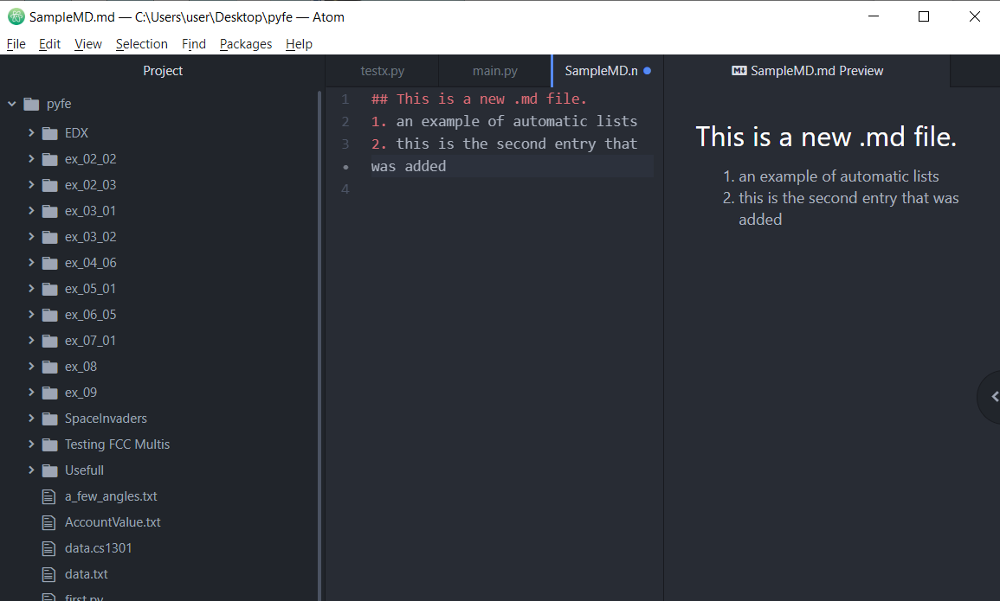

# Introductie van Markdown en Markup editors
Markdown is een WYSIWYM vorm van een open-source Markup Language. 

## Key-terms
- Markdown = een open-source Markup Language.
- WYSIWYM = What You See Is What You Mean 
- WYSIWYG = What You See Is What You Get

## Opdracht
-	Maak een document met je gekozen editor.
### Gebruikte bronnen
https://atom.io/ -> Ik werkte al met Atom.io dus heb ik gekozen om hiermee verder te gaan.  
https://www.portent.com/blog/content/atom-markdown.htm - > Verschillende packages om Atom.io een betere Markdown editor te maken.

### Ervaren problemen
Geen problemen.

### Resultaat
Opdracht is gelukt, zie hierbij de volgende screenshot:

