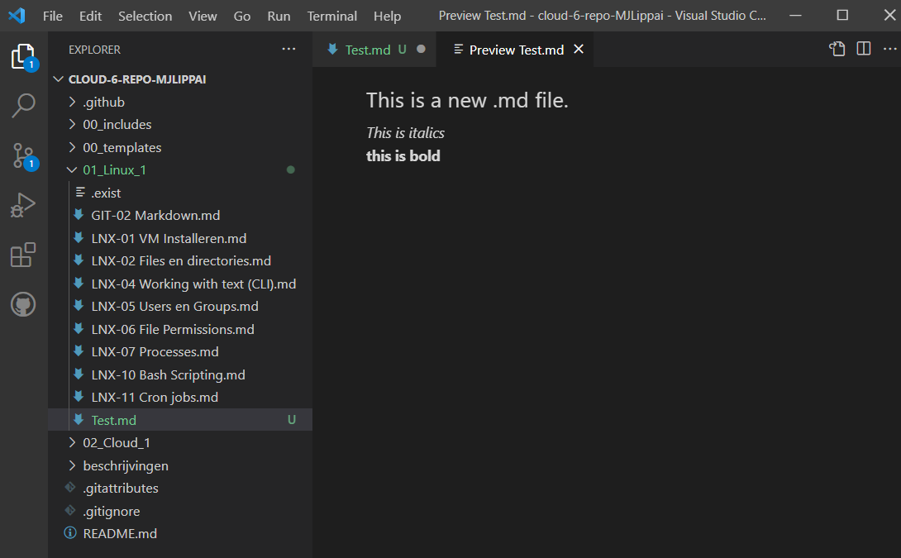

# Introductie van Markdown en Markup editors
Markdown is een WYSIWYM type van een open-source Markup Language. Het is een text-to-HTML conversie tool om geformateerde text te creëren met een plain-text editor.

## Key-terms
**Markdown** = een open-source Markup Language.  
**WYSIWYM** = What You See Is What You Mean.  
**WYSIWYG** = What You See Is What You Get.  
**Gedistrubueerde versiebeheer** = Iedereen heeft de hele code in zijn bezit. Er zijn meerdere voordelen hiervan zoals snel en automatisch te kunnen mergen en branchen.
**Gecentraliseerde versiebeheer** = Er is een centrale versie die iedereen moet aanpassen.  

## Opdracht
-	Maak een document met je gekozen editor.
### Gebruikte bronnen

https://www.portent.com/blog/content/atom-markdown.htm - > Verschillende packages om Atom.io een betere Markdown editor te maken.

### Ervaren problemen
Geen problemen.

### Resultaat
Opdracht is gelukt, zie hierbij de volgende screenshot:

