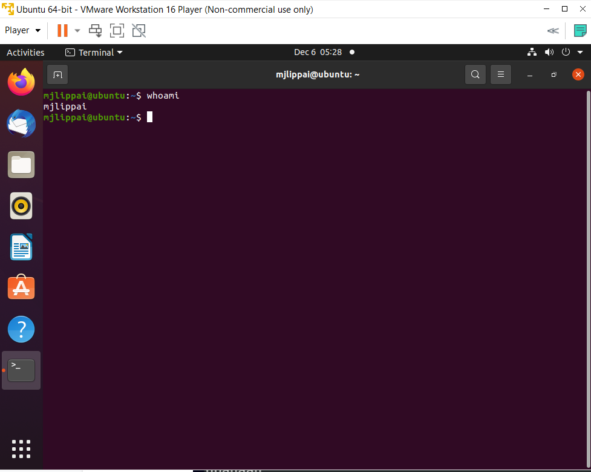

# Installatie van een VM
Virtualisatie houdt in dat er (in software) een geabstraheerde complete machineomgeving wordt gecreëerd, waaronder eindgebruikerssoftware draait zonder de fysieke details van de machine waarop deze draait.

Nu leren wij hoe een VM te creëren via Virtualization software. Ik gebruik bijvoorbeeld VMware.

## Key-terms
**Virtual machine** : virtualizatie van een competer systeem.  
**Ubuntu** : Ubuntu is a Linux distributie gebaseerd op Debian and bestaat bijna helemaal uit open-source code.  
**Hypervisor** : Ook gekent als Virtual Machine Monitor, hiermee kan je een Vm maken en draaien'.  
**Host Machine** : een computer waarop een hypervisor één of meer VMs draait wordt een "host machine" genoemd. Elke virtuele machine heet een "guest machine".  

## Opdracht

- Installeren van een Ubuntu virtueele machine op mijn laptop.  
- Snapshot creëren van het VM.  
- Termal openen en 'whoami" typen en een screenshot maken waar je username zichtbaar is.  

### Gebruikte bronnen
https://www.edx.org/course/introduction-to-linux (completed previously) : Een van de eerste hoofdstukken bescrijft verschillende methodes om een VM te creëren. Ik heb al toen gekozen om Ubuntu via VMware te intalleren.

### Ervaren problemen
Geen probleem aangezien ik de bovengenoemde cursus al een aantal maanden geleden had voltooid.

### Resultaat
Alles is gelukt! Zie de volgende screenshot :

