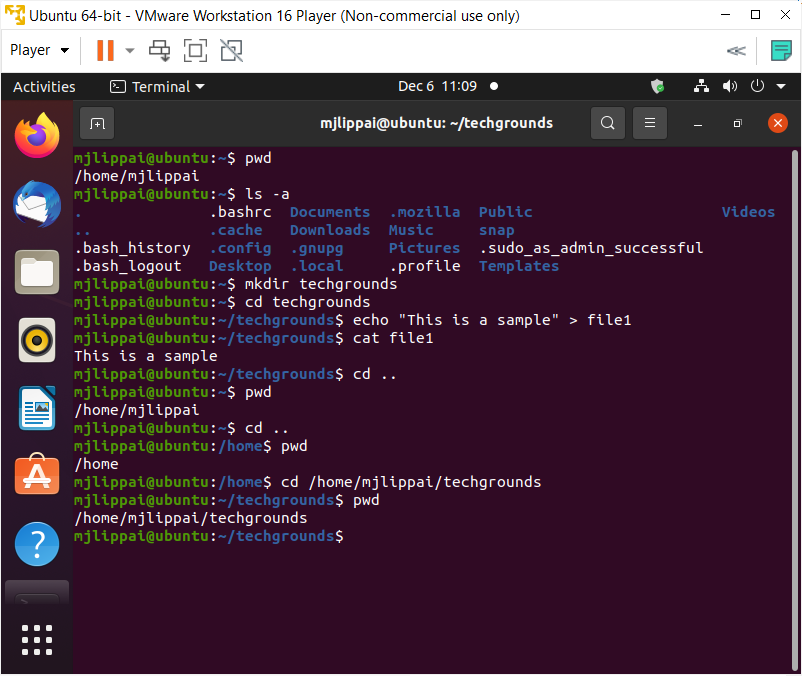

# Files en directories
In deze opdracht gaan we leren om files te creëren en door de filesysteem van Ubuntu te navigeren met gebruik van "absolute" en "relative" paths.

## Key-terms
Linux Filesytem : Linux heeft een Filesystem Hierarchy Standard. Dit zorgt ervoor dat er verschillende regels worden gevolgd zodat men makkelijker bestanden en mappen kunnen vinden.  
Absolute path: je gebruikt de voledige path vanaf de root directory tot waar je terecht wilt komen of iets veranderen.  
Relative path: je gebruikt een path alleen ten op zichte van welke directory je nu in zit.

## Opdracht
- huidige map vaststellen
- alle bestanden en mappen in je home map laten zien
- nieuwe map 'techgrounds' aanmaken
- een tekstbestand hier aanmaken die wat tekst bevat
- navigeren van de filesysteem met gebruikt van absoluut en relatief paden 

### Gebruikte bronnen
https://www.edx.org/course/introduction-to-linux ->> de benodigde vaardigheden zijn allemaal here in deze gratis cursus te vinden.  
https://www.geeksforgeeks.org/absolute-relative-pathnames-unix/  
https://www.geeksforgeeks.org/absolute-relative-pathnames-unix/

### Ervaren problemen
Geen problemen.

### Resultaat
Alles is gelukt, zie het volgende beeld:

