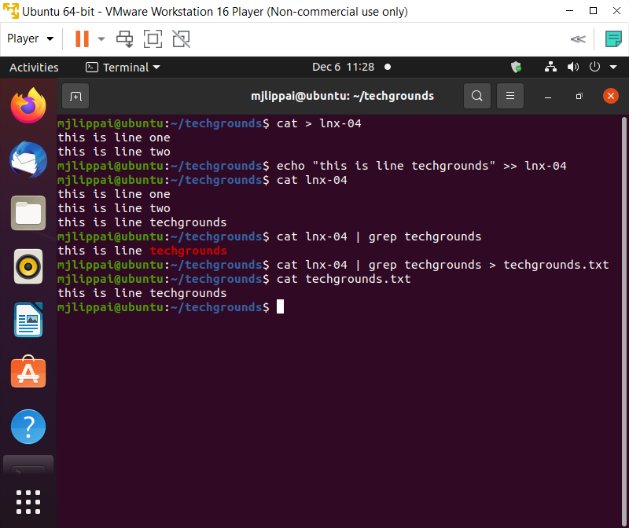

# Werken met tekst in Ubuntu/Linux
Leren om met verschillende commands tekst bestanden te creëren en aanpassen.

## Key-terms
**CLI** : de "command line interface" of ook de terminal genoemd waar je zonder GUI heel exacte werkingen kunt uitvoeren.  
**echo** : een command in linux waarmee je tekst bestanden kunt maken en aanpassen.  
**cat** : staat voor concatenate. Je kunt hiermee tekst van een of meerdere bestanden tegelijkertijd naar de terminal printen. Ook kan je files creëren of copiëren.  
**piping commands with "|"** : combineren van meerdere commandos om specifieke resultaten te kunnen produceren.  
**grep** : om door tekst of strings te zoeken.  

## Opdracht
- gebruikt echo om een nieuwe zin toe te voegen aan een bestande file. Nieuwe zin moet 'techgrounds' bevatten'.
- laat de inhoud van je bestand zien op de terminal. Gebruik nu een command om alleen de zin die 'techgrounds' bevat te tonen op de terminal.
- gebruik weer de command van stap twee om dezelfde zin met 'techgrounds' te selecteren maar hiermee dan een niewe bestand te creëren

### Gebruikte bronnen
https://www.edx.org/course/introduction-to-linux -> alles komt hierin voor.   
https://www.geeksforgeeks.org/cat-command-in-linux-with-examples/  
https://linuxhint.com/linux-pipe-command-examples/

### Ervaren problemen
Geen problemen.

### Resultaat
Alles is gelukt, zie hierbij het volgende bestand: 

