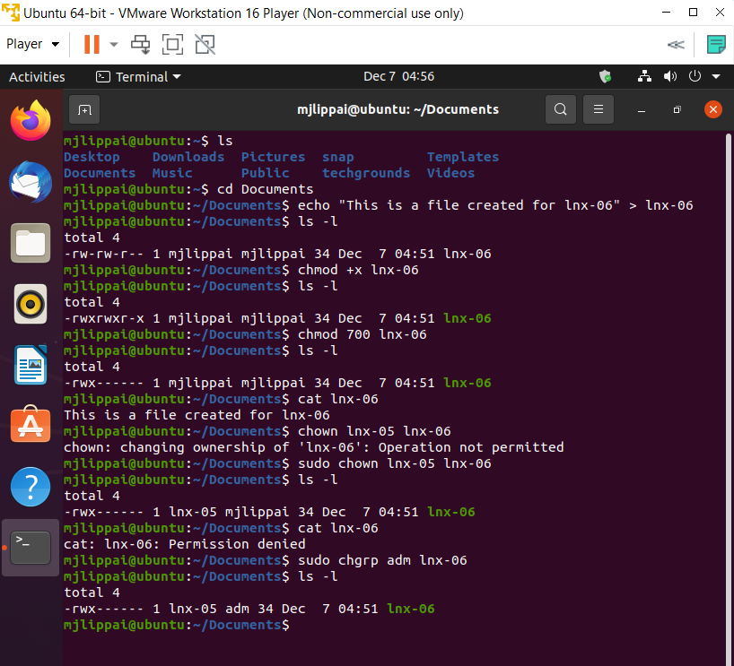

# File Permissions
Users hebben verschillende rechten mbt bestanden en mappen. Dit kan worden bepaald op een user of group niveau.  
De vershillende rechten zijn namelijk : reading(r), writing(w), executing(x).

## Key-terms
chmod : commando waarmee het mogelijk wordt om rechten in verband met bestanden of mappen te veranderen, met letters of getallen.

## Opdracht
- een tekst bestand aanmaken
- toon de rechten instellingen van het bestand, wie is de eigenaar en groep. Wat voor rechten types heeft het bestand.
- zorg ervoor dat de bestand executable is
- verwijder de read en write rechten (rw) van het bestand voor de groep en iedereen anders, maar niet van de eigenaar. Toon dat je het bestand nog kan zien/lezen (als eigenaar)
- verander de eigenaar van get bestand naar een andere gebruiker (hier heb ik de user van opdracht lnx-05 voor gebruikt). Toon dat je nu het file niet meer kan lezen
- verander welke groep eigenaar is naar een andere groep

### Gebruikte bronnen
https://chmod-calculator.com/  
https://www.edx.org/course/introduction-to-linux

### Ervaren problemen
Geen problemen tegengekomen.

### Resultaat
Vraag "Wat voor rechten types heeft het bestand":
Rechten zijn verdeeld onder owner, group en all users. In dit geval zijn de rechten als volgt (voor de veranderingen die later komen): -rw-rw-r-- (eerste streepje betekent normale bestand, in plaats van bijv een map dat zou schijnen als een "d". De rechten als volgt zijn verdeeld:
owner : rw- = read, write
group : rw- = read, write
all users : r-- = read

Alles is gelukt, zie hierbij de toegevoegde screenshot:

Opmerking: kan "chmod 711 file" in plaats van "chmod 700 file" gebruiken om dan de executable rechten voor "group" en "other" toe te laten.  

