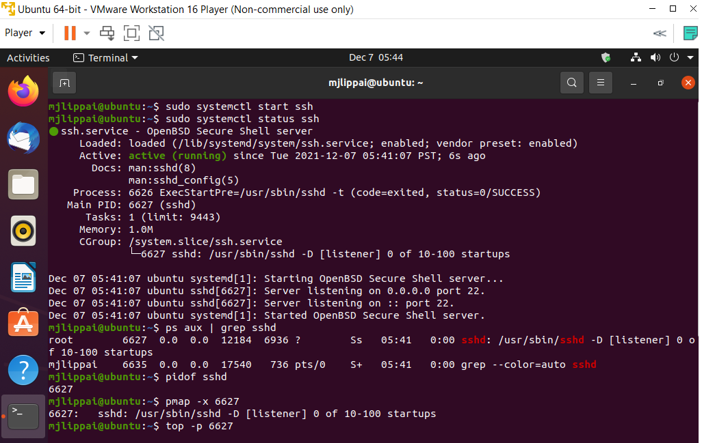
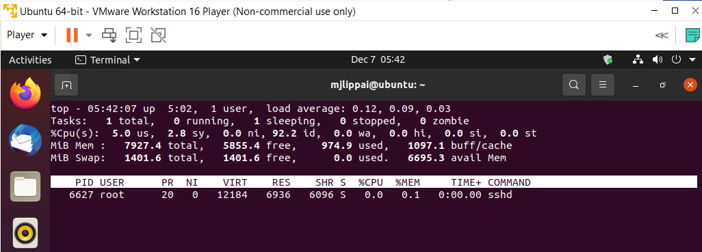
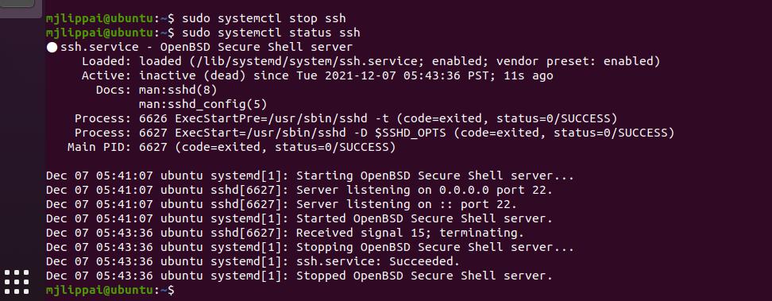

# Processes
Processen zijn allemaal instanties van code die aan het draaien is. Deze processen kunnen op meerdere manieren worden gemonitoreerd. In deze opracht ga ik een paar van deze methodes laten zien.

## Key-terms
**PID** : Process ID -> met sommige commands moet je de PID gebruiken, bij anderen gebruikt je de naam van het process.  
**Daemons**: processen die in het achtergrond draaien en je verder niet merkt behalve het starten en stoppen daarvan. Niet interactief.  
**Service**: processen die reageren op verzoeken van programmas. Deze kunnen interactief zijn.  
**Programs**: een programma wordt door een user gebruikt, zoals bijvoorbeeld vi editor.  

## Opdracht
- start de ssh daemon
- laat de PID van de ssh daemon tonen
- laat zien hoeveel gehuigen dit process gebruikt
- stop of "kill" dit process

### Gebruikte bronnen
https://www.edx.org/course/introduction-to-linux
https://linuxize.com/post/how-to-enable-ssh-on-ubuntu-18-04/
https://askubuntu.com/questions/392262/how-to-monitor-the-memory-consumed-by-a-process

### Ervaren problemen
Geen problemen tegengekomen.

### Resultaat
Alles is gelukt, zie toegevoegde bestanden. Er zijn meerdere manieren om aangevraagde informatie te tonen in de terminal:

  

top command resultaat:  
  

