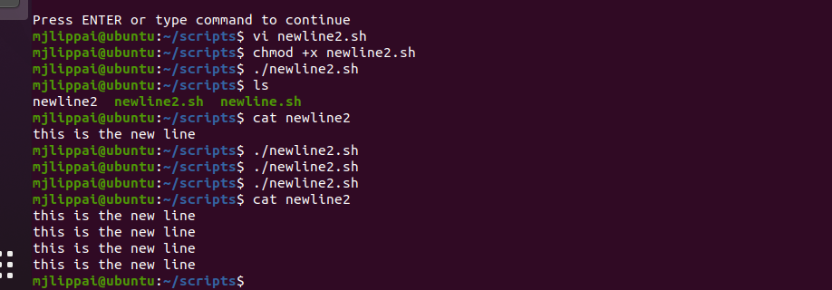
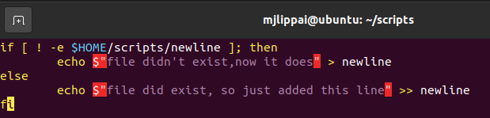
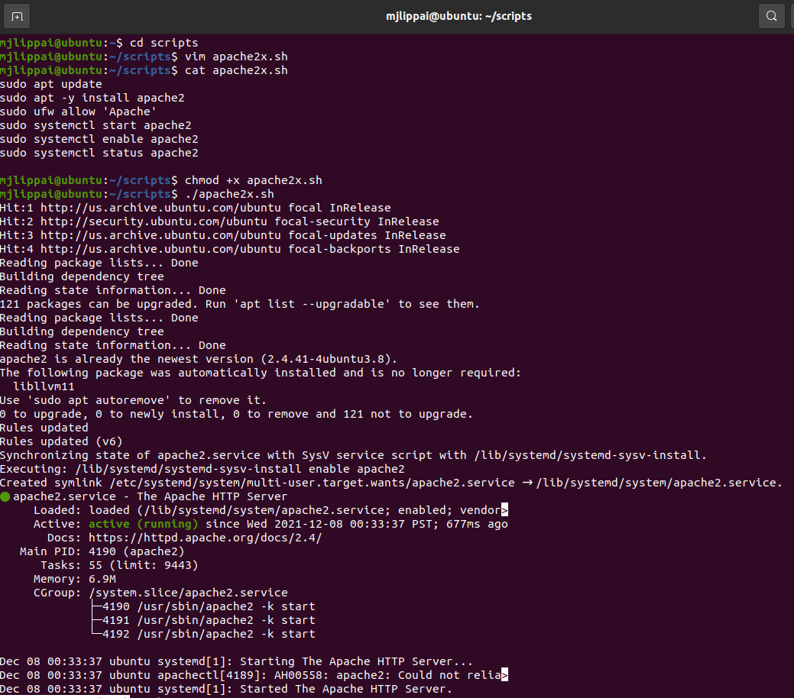
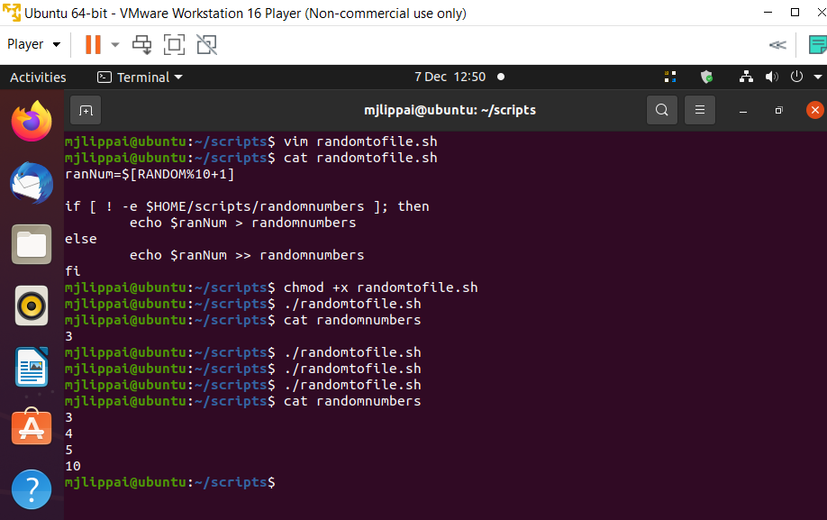

# Bash scripting
Met Bash scripting kan je meerdere commandos in een bestand scrijven. Deze kunnen dan allemaal worden uitgevoerd door deze bestand dan uit te voeren.

## Key-terms
PATH variable : mappen die worden gecheckt door de OS om de programma te kunnen draaien
RANDOM : een shell variable waarmee je willekeurige nummers kan opvragen
UFW : "uncomplicated firewall"-> een simpele firewall voor linux die waarmee makkelijk wordt om toegang te geven of negeren op basis van regels die je op moet stellen
Vim : is een implementatie van Vi standard met meerdere opties, het is een text editor waarmee je bestanden kan maken en veranderen. 

## Opdracht 1
- maak een nieuwe map die "scripts" heet. Plaats alle scripts hierin.
- voeg de nieuwe map aan de PATH variable
- maak een script dat een nieuwe lijn van tekst aan een bestand toevoegd elke keer dat hij wordt uitgevoerd
- maak een script dat httpd package installeert, httpd dan activeert, en httpd start. Ten einde, je script moet de status van de httpd daemon op de terminal toont

## Opdracht 2
- maak een script die een willekeurige nummer tussen de 1 en 10 kiest, het in een variable bewaart, en dan aan een tekst bestand toevoegt

## Opdracht 3
- maak een script die een willekeurige nummer tussen de 1 en 10 kiest, het in een variable bewaart, en dan aan een tekst bestand toevoegt alleen als hij groter dan 5 is. Anders moet er een zin worden toegevoegd in plaats van een nummer aan dezelfde bestand.

### Gebruikte bronnen
https://linuxize.com/post/how-to-add-directory-to-path-in-linux/  
https://stackoverflow.com/questions/1262903/add-to-file-if-exists-and-create-if-not  
https://appuals.com/set-bash-variables-random-numbers/  
https://stackoverflow.com/questions/8988824/generating-random-number-between-1-and-10-in-bash-shell-script  
https://linuxize.com/post/bash-if-else-statement/  

### Ervaren problemen
Bij de eerste opdracht wou ik een if/else statement gebruiken zodat als het bestand nog niet bestond dat hij voor het eerst zou worden aangemaakt (met een unique zin). Was in het begin wat moeilijk om uit te komen maar het is uiteindelijk wel gelukt met wat googlen. Daarna kon ik zelfde syntax gedeeltelijk in opdracht 2 gebruiken.

### Resultaat
Succesvol, zie toegevoegde beelden:

Opdracht 1.1  

Opdracht 1.2  

Opdracht 1.3  

Opdracht 2  

Opdracht 3  

