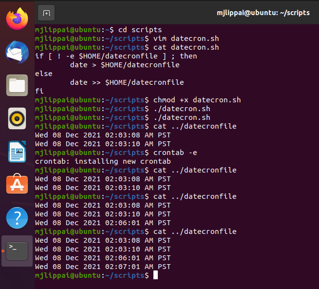
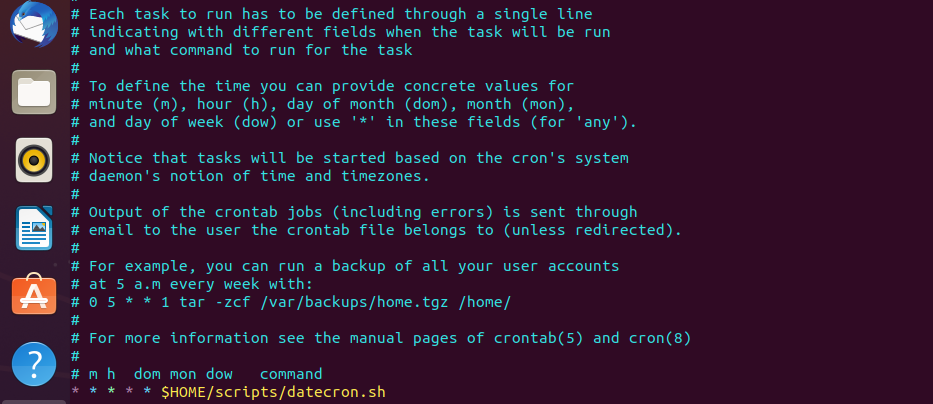
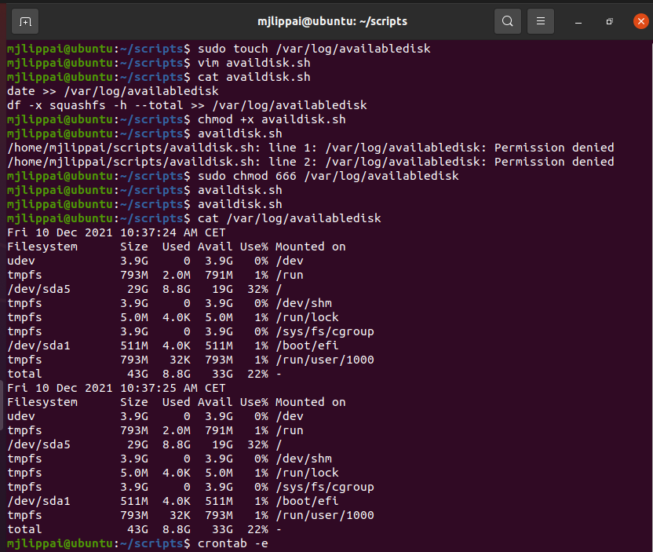
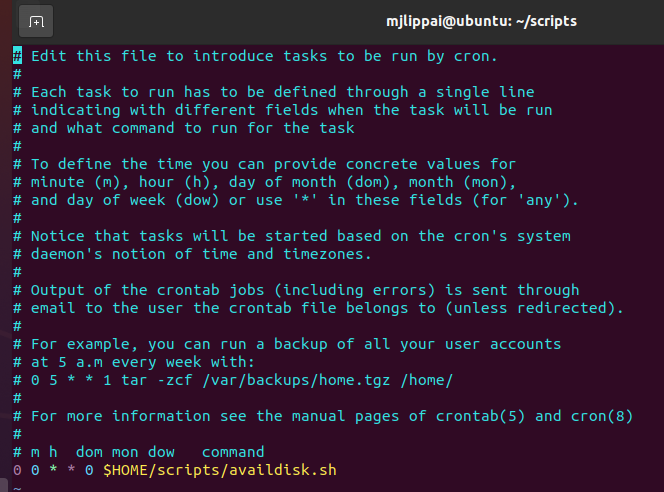

# Cron jobs
Met cron jobs kan je specifieke commandos of processen uitvoeren op bepaalde tijden.

## Key-terms
**crontab** : hiermee kan je bash scripts inplannen zodat ze op bepaalde or periodieke tijden draaien.  
**df** : "disk filesystem" -> hiermee kan informatie laten tonen van de verschillende filesystemen die verbonden zijn aan je "tree".

## Opdracht
- maak een Bash script die de huidige datum en tijd in een bestand in jouw home map bewaart
- regitreer dit bestand in crontab op een manier dat hij elke minuut draait
- maak een script dat de beschikbare ruimte op je hardschijf in een log bestand in 'var/logs' bewaart. Gebruik cron job zodat deze script elke week draait.

### Gebruikte bronnen
https://www.edx.org/course/introduction-to-linux  
https://stackoverflow.com/questions/43221469/write-current-date-time-to-a-file-using-shell-script  
https://www.howtogeek.com/409611/how-to-view-free-disk-space-and-disk-usage-from-the-linux-terminal/  

### Ervaren problemen
Bij de laatste opdracht heb ik 'var/log' in plaats van 'var/logs' gebruikt aangezien 'log' al bestond.  
Bij het bewaren van de beschikbare ruimte krijg ik eerst te veel info, dan heb ik een manier gevonden om de resultaten van de "-x squashfs" option van "df" om deze filesystemen te schuilen zodat het netter eruit zag. Ik heb ook de datum hierbij laten tonen voor een betere overzicht.

### Resultaat
Gelukt, zie toegevoegde beelden:

Opdracht 1.1  Additionally: "./" Not needed to run the program below if the PATH has been updated with that directory.  

Opdracht 1.2 Eenmaal je crontab -e gebruiked en je gewenste editor kiest (eerste keer):  

Opdracht 2.1  

Opdracht 2.2  In dit voorbeeld stelt 0 0 * * 0 > elke zondag op 0:00 (dus elke week van elke maand zijn de twee sterretjes:  

