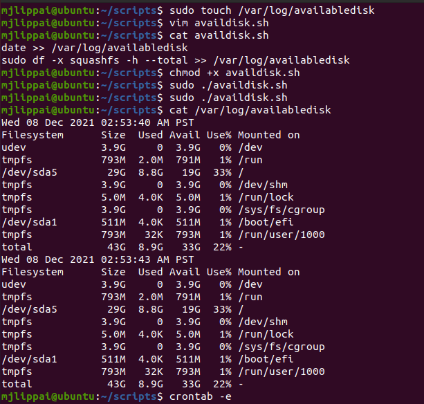

# Cron jobs
Met cron jobs kan je specifieke commandos of processen uitvoeren op bepaalde tijden.

## Key-terms
[Schrijf hier een lijst met belangrijke termen met eventueel een korte uitleg.]

## Opdracht
### Gebruikte bronnen
https://www.edx.org/course/introduction-to-linux  
https://stackoverflow.com/questions/43221469/write-current-date-time-to-a-file-using-shell-script  
https://www.howtogeek.com/409611/how-to-view-free-disk-space-and-disk-usage-from-the-linux-terminal/  

### Ervaren problemen
[Geef een korte beschrijving van de problemen waar je tegenaan bent gelopen met je gevonden oplossing.]

### Resultaat
Gelukt, zie toegevoegde beelden:

Opdracht 1.1  

Opdracht 1.2  

Opdracht 2.1  

Opdracht 2.2  

