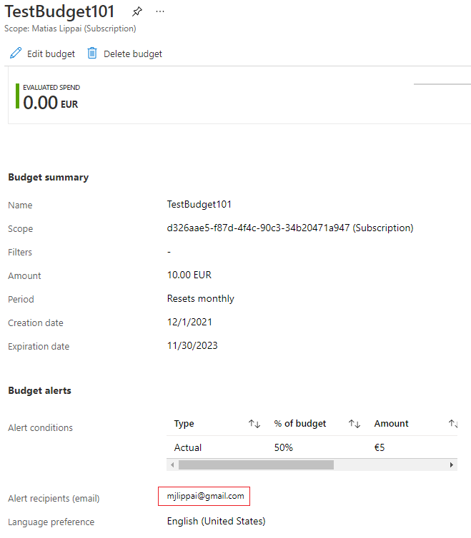

# Cost Management
Met de cloud is het mogelijk om alleen te betalen voor de bronnen die je gebruikt. Hierdoor is er sprakke van OPEX in plaats van CAPEX.
De “Cost Management + Billing” tool geeft inzicht in je uitgaven in Azure en stelt je in staat je subscriptions te beheren.

Wanneer je een `Free Account` of een `Student Account` aanmaakt krijg je een bedrag van Microsoft cadeau om in Azure mee te experimenteren. Houd er rekening mee dat na 30 dagen je subscription automatisch stop wordt gezet, waardoor al je nog draaiende diensten uitgezet worden.

Als je een `Pay-as-you-go` subscription heb aangemaakt zijn er een aantal diensten die tot een bepaald gebruik altijd gratis zijn. Begrijp wel dat deze diensten soms geïntegreerd zijn met andere diensten waar je wel voor moet betalen. 

Azure geeft de volgende principes om succesvol je kosten te reduceren:
-	Plan (Planning)
-	Zichtbaarheid (Visibility)
-	Verantwoording (Accountability)
-	Optimalisatie (Optimization)
-	Iteratie (Iteration)

De Total Cost of Ownership (TCO) wordt gebruikt om te berekenen hoeveel een infrastructuur kost als het op de traditionele manier gehost wordt. Met de TCO-calculator kan je de kosten van een traditionele infrastructuur vergelijken met de kosten voor dezelfde infrastructuur op Azure.

## Key-terms
[OPEX vs CAPEX](../beschrijvingen/OPEXvsCAPEX.md#OPEXvsCAPEX)   

[Cost Management hulpmiddelen](../beschrijvingen/Cost%20Management%Tools.md)

[TCO-calculater](../beschrijvingen/TCO-calculator.md)

## Opdracht 1
Bestudeer:
- De Azure principes voor kostenmanagement
- De voorwaarden van de Free subscription
- Het verschil tussen CAPEX en OPEX. -> [OPEX vs CAPEX](../beschrijvingen/OPEXvsCAPEX.md#OPEXvsCAPEX)   
- De TCO-calculator -> [TCO-calculater](../beschrijvingen/TCO-calculator.md)

## Opdracht 2
- Maak een alert aan waarmee je eigen Cloud Pass kan monitoren.

- Begrijp de opties die Azure aanbiedt om je uitgaven in
te zien.  

### Gebruikte bronnen
- https://docs.microsoft.com/nl-nl/azure/cost-management-billing/cost-management-billing-overview
- https://azure.microsoft.com/nl-nl/pricing/tco/

### Ervaren problemen
[Geef een korte beschrijving van de problemen waar je tegenaan bent gelopen met je gevonden oplossing.]

### Resultaat

Opdracht 2.1 Example Alert:

