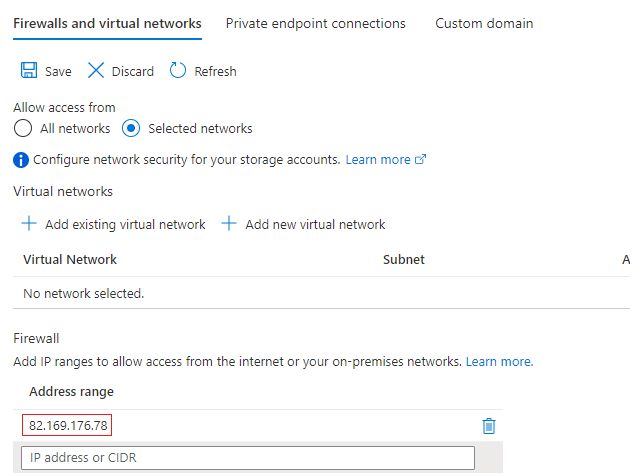
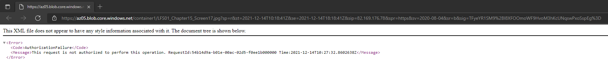
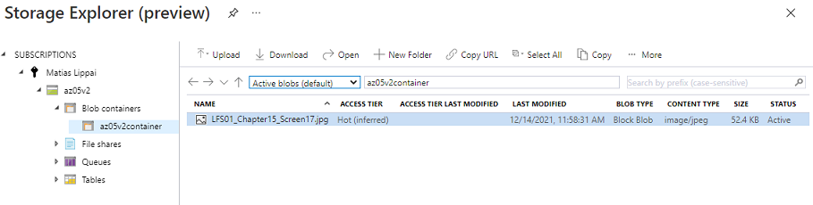

# Azure Storage Account
Data kan worden opgeslaan door het gebruik van een Azure Storage Account in de vorm van : blobs, disks, files of tables.

Alle data in een Storage Account is bereikbaar via het internet met HTTP en HTTPS. Omdat het makkelijk te bereiken is moet je goed opletten dat alleen de juiste identiteiten permissies hebben om bij de data te komen.

Azure Storage explorer is een gratis GUI om je data te beheren in Azure.

Veel IaaS en PaaS services van Azure maken ook gebruik van Azure Storage Accounts.

## Key-terms
**Azure Blob storage** -  een geoptimaliseerde object storage oplossing in de cloud voor het bewaren van groot en ongestructureerde bestanden.
**Azure managed disks** - blok-nivaeu opslagvolumes die worden beheerd door Azure en gebruiked door Azure Virtual Machines.
**Azure Files** - gebruiken van SMB-protocol (Industry Standard Server Message Block) of het NFS-protocol (Network File System) om volledig beheerde bestandaandelen in de cloud aan te maken.
**Azure Table Storage** - een service die niet-relationele gestructureerde gegevens (ook wel gestructureerde NoSQL-gegevens genoemd) opgeslagen in de cloud, waardoor een sleutel-/kenmerkopslag wordt voorzien van een schemaloos ontwerp.

## Opdracht
-	Maak een Azure Storage Account. Zorg dat alleen jij toegang hebt tot de data.
-	Plaats data in een storage service naar keuze via de console (bijvoorbeeld een kattenfoto in Blob storage).
-	Haal de data op naar je eigen computer door middel van de Azure Storage Explorer.
 
### Gebruikte bronnen
https://docs.microsoft.com/nl-nl/azure/storage/common/storage-account-overview
https://docs.microsoft.com/nl-nl/azure/storage/files/storage-files-introduction
https://docs.microsoft.com/en-us/azure/storage/blobs/storage-blobs-introduction
https://docs.microsoft.com/en-us/azure/virtual-machines/managed-disks-overview
https://help.ubuntu.com/community/InstallingANewHardDrive

### Ervaren problemen
Geen Problemen.

### Resultaat
Opdracht 1.1 - IP beperking:

Testen van access vanaf een andere pc:

Opdracht 1.2 en 1.3 Azure Storage explorer:
