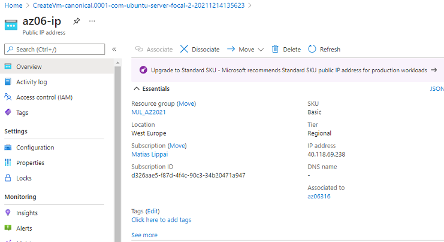
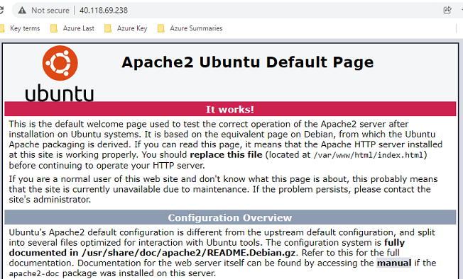

# Azure Virtual Machines
Azure Virtual Machines (VM) vormen een van de diverse typen schaalbare on-demand computerresources die Azure biedt. Normaal gesproken kiest u voor een VM wanneer u meer controle nodig hebt over de computeromgeving dan andere opties bieden. In dit artikel vindt u informatie over wat u moet overwegen voordat u een VM maakt, hoe u deze maakt en hoe u deze beheert.

Een VM in Azure biedt u de flexibiliteit van virtualisatie zonder dat u de fysieke hardware hoeft te kopen en te beheren waarop de VM wordt uitgevoerd. U moet de VM echter wel onderhouden door taken uit te voeren, zoals het configureren, patchen en onderhouden van de software die erop wordt uitgevoerd.

Virtuele machines in Azure kunnen op verschillende manieren worden gebruikt. Een aantal voorbeelden:

Ontwikkeling en tests: Azure-VM’s bieden een snelle en eenvoudige manier om een computer te maken met specifieke configuraties die nodig zijn voor de code van een toepassing en het testen ervan.
Toepassingen in de cloud: De vraag naar uw toepassing kan variëren, dus kan het financieel verstandig zijn om deze uit te voeren op een VM in Azure. U betaalt voor extra virtuele machines wanneer u ze nodig hebt en schakelt ze uit wanneer u ze niet meer nodig hebt.
Uitgebreid datacenter: Virtuele machines in een virtueel Azure-netwerk kunnen eenvoudig worden verbonden met het netwerk van uw organisatie.
Het aantal virtuele machines dat uw toepassing gebruikt, kan omhoog worden geschaald naar wat is vereist om te voldoen aan uw behoeften.

## Key-terms
[Schrijf hier een lijst met belangrijke termen met eventueel een korte uitleg.]

## Opdracht
-	Log in bij je Azure Console.
-	Maak een VM met de volgende vereisten:
-	Ubuntu Server 20.04 LTS - Gen1
-	Size: Standard_B1ls
-	Allowed inbound ports:
-	HTTP (80)
-	SSH (22)
-	OS Disk type: Standard SSD
-	Networking: defaults
-	Boot diagnostics zijn niet nodig
-	Custom data: 
	#!/bin/bash
sudo su
apt update
apt install apache2 -y
ufw allow 'Apache'
systemctl enable apache2
systemctl restart apache2
-	Controleer of je server werkt.
-	Let op! Vergeet na de opdracht niet alles weer weg te gooien. Je kan elk onderdeel individueel verwijderen, of je kan in 1 keer de resource group verwijderen.

### Gebruikte bronnen
https://docs.microsoft.com/nl-nl/azure/virtual-machines/linux/overview

### Ervaren problemen
[Geef een korte beschrijving van de problemen waar je tegenaan bent gelopen met je gevonden oplossing.]

### Resultaat
Opdracht 1.1 VM ip adres:

Opdracht 1.2 Bewijs server is live:

