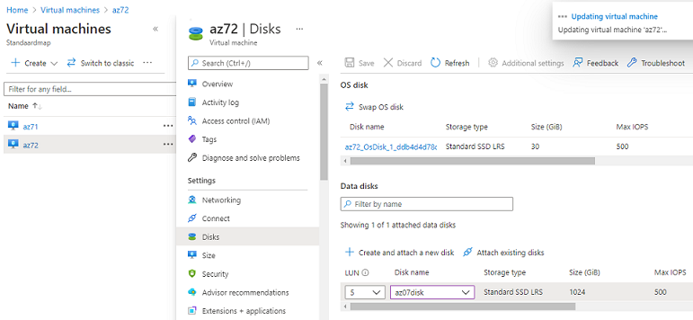

# Azure Disk Storage
Beheerde Azure-schijven (managed disks)zijn opslagvolumes op blokniveau die worden beheerd door Azure en worden gebruikt met Azure Virtual Machines. Beheerde schijven zijn net als een fysieke schijf op een on-premises server, maar gevirtualiseerd. Bij beheerde schijven hoeft u alleen de schijfgrootte en het schijftype op te geven en de schijf in terichten. Zodra u de schijf hebt ingericht, verwerkt Azure de rest.

De beschikbare typen schijven zijn Ultra Disks, Premium SOLID-State Drives (SSD), Standard SSD's en Standard Hard Disk Drives (HDD). Zie Een schijftype selecteren voor IaaS-VM'svoor meer informatie over elk afzonderlijk schijftype. 

Voordelen beheerde scijven:
- Uiterst duurzaam en beschikbaar
- Eenvoudige en schaalbare VM-implementatie
- Integratie met beschikbaarheidssets
- Integratie met beschikbaarheidszones
- Ondersteuning voor Azure Backup
- Gedetailleerd toegangsbeheer (Azure RBAC) 
- Uw vhd (virtuele hard schijf) uploaden
- sterker b eveiliging door: Privékoppelingen, Versleuteling, Versleuteling aan de serverzijde, Azure Disk Encryption

Er zijn drie belangrijke schijfrollen in Azure: de gegevensschijf, de besturingssysteemschijf en de tijdelijke schijf. 

## Key-terms
**LUN** : logical unit numbers -> gebruikt om computer opslag te identificeren  
**Gegevensschijf** : Een gegevensschijf is een beheerde schijf die is gekoppeld aan een virtuele machine om toepassingsgegevens op te slaan, of andere gegevens die u moet bewaren. Gegevensschijven worden geregistreerd als SCSI-station en zijn voorzien van een door u gekozen letter.  
**Besturingssysteemschijf**: Elke virtuele machine heeft een gekoppelde besturingssysteemschijf. Die besturingssysteemschijf heeft een vooraf geïnstalleerd besturingssysteem dat is geselecteerd toen de virtuele machine werd gemaakt. Deze schijf bevat het opstartvolume.  
**Tijdelijke schijf**: De meeste VM's bevatten een tijdelijke schijf, die geen beheerde schijf is. De tijdelijke schijf biedt kortetermijnopslag voor toepassingen en processen en is bedoeld om alleen gegevens op te slaan, zoals pagina- of wisselbestanden.  
**Snapshot**: Een momentopname van een beheerde schijf is een alleen-lezen, crashconsistente volledige kopie van een beheerde schijf die standaard wordt opgeslagen als standaard beheerde schijf. Met momentopnamen kunt u op elk moment een back-up maken van uw beheerde schijven.  

## Opdracht
-	Start 2 Linux VMs. Zorgt dat je voor beide toegang hebt via SSH
-	Maak een Azure Managed Disk aan en koppel deze aan beide VMs tegelijk.
-	Creëer op je eerste machine een bestand en plaats deze op de Shared Disk.
-	Kijk op de tweede machine of je het bestand kan lezen.
-	Maak een snapshot van de schijf en probeer hier een nieuwe Disk mee te maken
-	Mount deze nieuwe Disk en bekijk het bestand. 

### Gebruikte bronnen
https://help.ubuntu.com/community/InstallingANewHardDrive
https://superuser.com/questions/934678/fdisk-do-i-need-it-or-can-i-make-a-filesystem-directly
https://www.howtogeek.com/443342/how-to-use-the-mkfs-command-on-linux/
https://superuser.com/questions/676093/partition-not-showing-up-in-dev
https://docs.microsoft.com/en-us/azure/virtual-machines/disks-types
https://docs.microsoft.com/nl-nl/azure/virtual-machines/managed-disks-overview

### Ervaren problemen
Eenmaal de gedeelde disk in de tweede vm werd aangeschakelt moest ik eerst fdisk met optie v gebruiken anders werd de partition niet erkend door de system. Daarna kon je heb wel in lsblk zien en vervolgens mounten.

### Resultaat
Alles is gelukt zie toegevoegde screenshots:  

az-07.0 - Disk maken met shared disk optie geselecteer:  
  
az-07.1 - Gedeelde disk toevoegen:  
  
az-07.2 - Gedeelde disk partition maken met fdisk:  
  
az-07.3 - Partitie filesysteem installeren met mkfs. Disk mounten en nieuwe file maken in gedeelde disk:  
  
az-07.4 - fdisk met v optie gebruiken om partitie te herkennen vanaf de andere vm:  
  
az-07.5 - gedeelde disk in tweede vm mounten en bestand lezen:  
  
az-07.6 - Snapshot maken:  
  
az-07.7 - disk die van snapshot is gemaakt mounten en zelfde bestand (gecopieerd) lezen:  
  
cloud-6-repo-MJLippai\00_includes\lnx-07.2.png