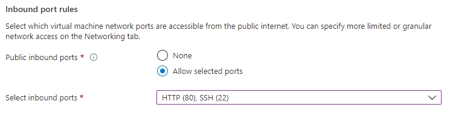
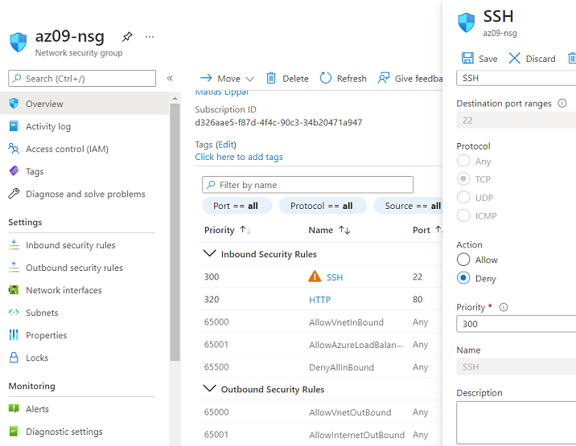
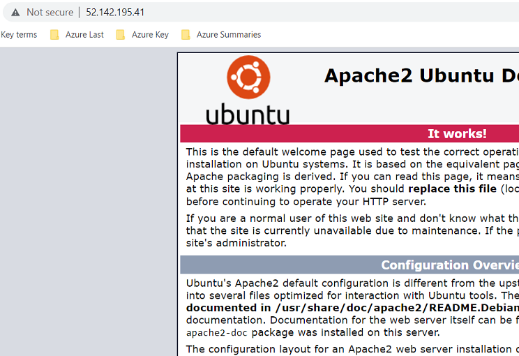

# Azure Firewall
Azure Firewall is een beveiligingsservice dat ervoor zorgt dat jouw cloud activiteiten beschermd worden tegen bedreigingen. Het heeft verder geen invloed op de schaalbaardheid of beschikbaarheid van jouw cloud initiatieven.

Azure Firewall is een stateful firewall die beschikbaar is in een Standard of Premium versie.
Verschillende configuraties zijn mogelijk, zoals een subnet, of in een hub-and-spoke netwerk. Een Firewall heeft altijd een publiek IP adres waar al het inkomend verkeer naartoe gestuurd dient te worden. En een privé IP adres waar al het uitgaande verkeer naartoe moet.

## Key-terms
Subnet : een selectie van IP-addressen die onderdeel maakt van een virtuele netwerk.
hub-and-spoke : een netwerk die een centrale component heeft die aan meerdere netwerks gelinked is, ook vaak een star netwerk genoemd.
stateful firewall : monitoreerd de volle staat van alle active netwerk verbinden.
stateless firewall : aandacht wordt gericht op individuele data packeten waar vooraf ingestelde regels gebruikt worden om de data verkeer te controleren.

## Opdracht
Bestudeer:
-	Het verschil tussen Basic en Premium Firewall
-	Het verschil tussen een Firewall en een Firewallbeleid (Firewall Policy)
-	Dat Azure Firewall veel meer is dan alleen een firewall

Opdracht:
-	Zet een webserver aan. Zorg dat de poorten voor zowel SSH als HTTP geopend zijn.
-	Maak een Azure Firewall in VNET. Zorg ervoor dat je webserver nog steeds bereikbaar is via HTTP, maar dat SSH geblokkeerd wordt.

### Gebruikte bronnen
https://docs.microsoft.com/en-us/azure/firewall/overview
https://docs.microsoft.com/en-us/azure/virtual-network/network-overview
https://peoplactive.com/azure-firewall-premium-protect-your-network-resources/

### Ervaren problemen
[Geef een korte beschrijving van de problemen waar je tegenaan bent gelopen met je gevonden oplossing.]

### Resultaat

Bestudeer:
-	Het verschil tussen Basic en Premium Firewall:
[Basic vs Premium Firewall](../beschrijvingen/BasicVsPremium.md)
-	Het verschil tussen een Firewall en een Firewallbeleid (Firewall Policy)
-	Dat Azure Firewall veel meer is dan alleen een firewall

Opdracht:

Instellingen om HTTP en SSH toe te laten:  

Instellingen NSG SSH te ontkennen:  

HTTP server n0g bereikbaar:  

SSH niet bereikbaar:  
