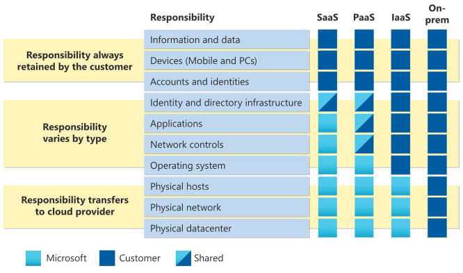

# Shared Responsibility Mode

Gedeelde verantwoordelijkheid is een natuurlijk gevolg van de samenwerkingsovereenkomsten tussen cloudproviders en hun klanten. Waar de verantwoordelijkeid ligt in verschillende gevallen, zoals wie voor welke beveiligingstaken moet zorgen, wordt voor een groot deel bepaald door het soort dienst of samenwerkingsverband dat er sprake van is. De mogelijkheden zijn: SaaS (Software as a Service), PaaS (Platform as a Service), Infrastructure as a Service (IaaS) of in een on-premises datacenter.

Standaarden zoals National Institute of Standards and Technology (NIST) (Speciale publicatie 500-292) en de PCI Standards Council (Information Supplement: PCI DSS Cloud Computing Guidelines) bieden overwegingen voor gedeelde verantwoordelijkheden.

Voor elk type cloudimplementatie is de klant eigenaar van zijn gegevens en identiteiten. Hij is verantwoordelijk voor de beveiliging hiervan, lokale bronnen en de cloudonderdelen die de klant controleert (afhankelijk van het servicetype).

Dus ongeacht het type implementatie worden de volgende verantwoordelijkheden altijd door de klant bewaard:

-   Gegevens
-   Eindpunten
-   Account
-   Toegangsbeheer

Overzicht:  

## Key-terms
**Endpoints** : Een endpoint is een remote computerapparaat dat heen en weer communiceert met een netwerk waarmee het is verbonden.
**NIST** : Is een laboratorium voor natuurwetenschappen en een niet-regulerend agentschap van het Amerikaanse ministerie van Handel.  
**PCI Standards Council** De "Payment Card Industry Security Standards Council"  werd gevormd met als doel het begeleiden van de voortgaande ontwikkeling van de "Payment Card Industry Data Security Standard"  

## Opdracht
Bestudeer:
-   Het Azure Shared Responsibility model
### Gebruikte bronnen
https://docs.microsoft.com/NL-NL/azure/security/fundamentals/shared-responsibility

https://www.nist.gov/news-events/news/2011/10/final-version-nist-cloud-computing-definition-published
https://docs.microsoft.com/nl-nl/azure/architecture/framework/security/overview 

### Ervaren problemen
Geen.

### Resultaat
Gelukt. Er zijn meerdere bronnen gevonden om de gedeelde verantwoordelijkheid model te bestuderen. Zie intro, key terms en beelden.

Nog een overzicht:   
  
[Azure White Paper Shared responsability](https://azure.microsoft.com/mediahandler/files/resourcefiles/shared-responsibility-for-cloud-computing/Shared%20Responsibility%20for%20Cloud%20Computing-2019-10-25.pdf)