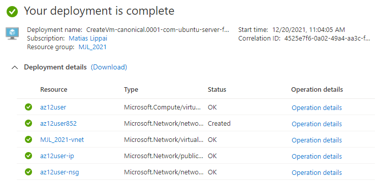
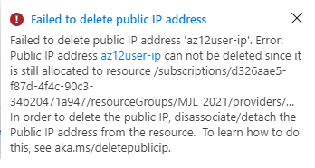
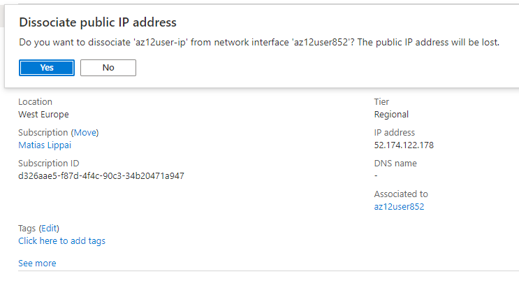

# IP adressen
IP-addressen zorgen ervoor dat meerdere endpoints elkaar kunnen lokaliseren, het is een logisch adres.
Met publieke IP-adressen kunnen internetbronnen binnenkomende naar Azure-bronnen communiceren. Prive IP-adressen worden gebruikt zodat endpoints binnen een netwerk met elkaar kunnen communiceren.

Er zijn twee soorten IP-adressen:
IPv4: heeft 32 bits (4 bytes) en heeft de volgende vorm: 82.169.176.78. > iedere blok is 1 byte. Er zijn meer dan 4 biljoen addressen mogelijk en deze raken eventueel op (eigenlijk al).

**IPv6** : heeft 128-bits en gerepresenteert als acht groepen van vier hexadecimale digits die door dubbele punten zijn gescheiden. Theoretisch zijn er 3.4×1038 IPv6 addressen mogelijk. Er zijn naar de totaal aantal adressen ook andere voordelen van IPv6 :
    -   hiërarchische adres allocatie methoden dat die routelaggregatie via internet faciliteert en dus de  de uitbreiding van routingtabellen beperkt 
    -   multicast adressen zijn uitgebreid, gesimplificeerd en zorgt ervoor dat het leveren van dienst geoptimaliseerd is
    -   bij het ontwerp van het protocol zijn aspecten van mobiliteit, veiligheid en configuratie in overweging genomen

Aangezien de beperkte hoeveelheid IPv4 adressen zijn bepaalde maatregelen genomen om nog langer met IPv4 te kunnen werken. Een voorbeeld hiervan is dat je modem maar één publiek IP adres dat je deelt met alle apparaten op het netwerk. Dit is mogelijk vanwege een NAT-tabel in je modem.

**NAT** (Network address translation/network masquerading/IP masquerading) is een verzamelnaam voor technieken die gebruikt worden in computernetwerken waarbij de adresinformatie in de datapakketjes veranderd wordt.

Een NAT-tabel zorgt ervoor dat data naar de juiste computers in je privé netwerk gestuurd worden door bij te houden welkverbindingen de apparaten in je privé netwerk maken.

Addressen die gereserveerd zijn voor privé netwerken:
-	192.168.0.0 - 192.168.255.255
-	172.16.0.0 - 172.31.255.255
-	10.0.0.0 - 10.255.255.255

Aws en Azure gebruiken nogsteeds voornamelijk IPv4, hoewel IPv6 mogelijk is om aan te schakelen.

## Key-terms
**NIC in Azure** : verbinding tussen een VM en de onderliggenden software netwerk. Een VM kan aan meerdere NICs gebonden zijn. 

## Opdracht
Bestudeer (zie intro):
-	IP adressen
-	IPv4 en IPv6
-	Public en Private IPs
-	NAT

Opdrachten
-	Ontdek wat je publieke IP adres is van je laptop en mobiel op wifi
-	Ontdek wat je publieke IP adres is op je mobiel via mobiel internet (als mogelijk)
-	Maak een VM in je cloud met een publiek IP. Maak verbinding met deze VM.
-	Verwijder het publieke IP adres van je VM. Begrijp wat er gebeurt met je verbinding.

### Gebruikte bronnen
https://docs.microsoft.com/en-us/azure/virtual-network/ip-services/remove-public-ip-address-vm  
https://serverfault.com/questions/882903/implications-for-removing-a-public-ip-address-from-vm-hosted-in-azure/883159
https://ubuntuhandbook.org/index.php/2020/07/find-ip-address-ubuntu-20-04/
https://docs.microsoft.com/en-us/azure/virtual-network/virtual-network-network-interface

### Ervaren problemen
IP addressen kunnen niet zo maar worden verwijderd, ze moeten eerst worden gedissociëreerd.  

### Resultaat

Opdrachten
-	Ontdek wat je publieke IP adres is van je laptop en mobiel op wifi
    Laptop: 82.169.176.78   
    Mobile: 82.169.176.78   
-	Ontdek wat je publieke IP adres is op je mobiel via mobiel internet (als mogelijk)
    Mobile: 109.36.144.244

-	Maak een VM in je cloud met een publiek IP. Maak verbinding met deze VM.  

-	Verwijder het publieke IP adres van je VM.  

    IP kan niet zo maar worden verwijderd:   
      

    IP dissociëren:   
      

    SSH public blocked:    
      

-   Begrijp wat er gebeurt met je verbinding.
    Het is niet meer mogelijk om via publieke IP in te loggen met SSH, moet dus via een VM op de dezelfde VNET gebeuren: private ip naar private ip.  
    Blijkbaar is het ook niet meer mogelijk om de NIC (Network Interface) te restarten als je de IP verwijdert.