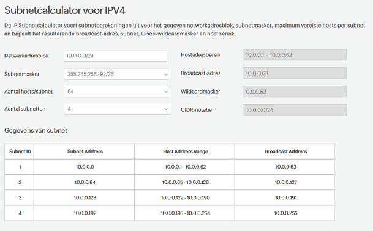

# Subnetting

Een subnet is een netwerk binnen een andere netwerk, meestal kleiner hoewel het ook mogelijk is om alle adressen aan alleen één subnet te besteden.

Een belangrijke kenmerk van een succesvolle IPv4-subnetting-strategie is consistentie. Veel beheerders richten te veel aandacht aan de perfecte grootte te maken voor de huidige behoeften. Maar onvermijdelijk breidt het bedrijf zich uit, en die kleinere subnetten zijn niet langer groot genoeg om het toenemende aantal apparaten aan te kunnen. Een goed praktijk is om zowel voor vandaag als toekomstige netwerk- en IP-uitbreiding behoeftn te plannen.

IP adressen zijn verdeeld in twee onderdelen: 
    -   een prefix/subnet mask: gedeelte van ip dat als netwerk adress wordt beschouwd.
    -   host address range: bits die gereserveerd zijn voor de host.

Kleinste subnet die Azure ondersteunt in vorm van CIDR notation: /29
Kleinste subnet die AWS ondersteint: /28 

## Key-terms
**CIDR**: Classless Inter-Domain Routing is een methode voor het allocatie van IP adressen en IP routing. 
**Subnetmask** : identificeert welke group ip adressen tot de subnet hoort, waar de data packets naartoe moeten als ze door een netwerk doorheen gaan en hoeveel hosts een subnet mag hebben.  
**Broadcast Address** : het adres dat kan worden gebruikt om naar alle systemen binnen een specifieke subnet te zenden.  
**hosts** : alle systemen in een subnet.  

## Opdracht

-	Maak een netwerkarchitectuur die voldoet aan de volgende eisen:
-	1 private subnet dat alleen van binnen het LAN bereikbaar is. Dit subnet moet minimaal 15 hosts kunnen plaatsen.
-	1 private subnet dat internet toegang heeft via een NAT gateway. Dit subnet moet minimaal 30 hosts kunnen plaatsen (de 30 hosts is exclusief de NAT gateway).
-	1 public subnet met een internet gateway. Dit subnet moet minimaal 5 hosts kunnen plaatsen (de 5 hosts is exclusief de internet gateway).
-	Plaats de architectuur die je hebt gemaakt inclusief een korte uitleg in de Github repository die je met de learning coach hebt gedeeld.
-	Zie in word document een voorbeeld van hoe je een netwerkarchitectuur kan visualiseren.

### Gebruikte bronnen
https://en.wikipedia.org/wiki/Subnetwork
https://www.youtube.com/watch?v=z07HTSzzp3o
https://arstechnica.com/civis/viewtopic.php?f=10&t=284408
https://docs.microsoft.com/en-us/azure/architecture/icons/
https://docs.microsoft.com/en-us/azure/vpn-gateway/vpn-gateway-about-vpngateways
https://www.dnsstuff.com/subnet-ip-subnetting-guide
https://www.site24x7.com/nl/tools/ipv4-subnet-rekenmachine.html
https://docs.microsoft.com/en-us/azure/virtual-network/virtual-networks-faq

### Ervaren problemen
Het was een leuke uitdaging om subnets en subnet calculators te begrijpen en leren hoe goed gebruik van ze te maken. Eerst had ik de Subnet Adressen verkeerd gerekend, maar dit heb ik later met verder onderzoek (youtube link bronnen) kunnen corrigeren.

### Resultaat  

Uitleg van gemaakte Netwerkarchitectuur:  
Grootte van Vnet: 10.0.0.0/24 geeft 256 mogelijke IPs (2 tot de macht 8).  
Er werd gekozen for CIDR /26 voor de subnetten om ruimte voor toekomstige groei toe te staan. CIDR /26 geeft 64 IPs per subnet, waarvan sommige ook gereserveerd moeten blijven voor bijvoorbeeld Broadcast Adres en de eerste (Subnet Adres).   Azure reserveert 5 IP adressen:    

    x.x.x.0: netwerkadres
    x.x.x.1: Gereserveerd door Azure voor de standaardgateway
    x.x.x.2, x.x.x.3: Gereserveerd door Azure om de Azure DNS-IP's toe te wijzen aan de Vnet-ruimte
    x.x.x.255: Broadcast-adres van het netwerk voor subnetten van grootte /25 en groter. Dit zal een ander adres zijn in kleinere subnetten.

Subnetcalculator resultaten:  

Opdracht netwerkarchitectuur:  
