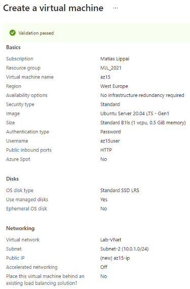
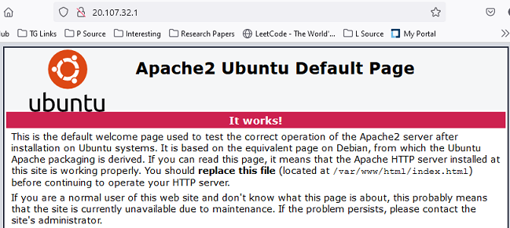

# Azure Virtual Network
Azure virtual networks (VNets) zijn essentieel om een prive netwerk met Azure op te kunnen richten, ze zorgen voor de verbinding tussen VMs, web apps, internet gebruikers en on-premises machines. 

VNets zijn vergelijkbaar met traditionele netwerks die op datacenters draaien maar hebben ook de voordelen die de infrastructuur van Azure biedt zoals makkelijk schalen, beschikbaarheid en isolatie.  

Een Azure Virtual Network (Vnet) is een weergave van uw eigen netwerk in de cloud. Het is een logische isolatie van de Azure-cloud die aan uw abonnement is gewijd. U kunt VNets gebruiken om virtuele particuliere netwerken (VPN's) in Azure in te richten en te beheren en desgewenst de VNets te koppelen aan andere VNets in Azure, of met uw lokale IT-infrastructuur om hybride of cross-premises oplossingen te maken. Elk Vnet dat u maakt heeft zijn eigen CIDR-blok en kan worden gekoppeld aan andere VNets en lokale netwerken zolang de CIDR-blokken elkaar niet overlappen. U hebt ook controle over DNS-serverinstellingen voor VNets, en segmentatie van het Vnet in subnetten.

Om een Vnet te verbinden met een on-premises netwerk zijn er drie mogelijkheden:

    -   Point-to-site virtual private network (VPN): Ingesteld tussen een virtueel netwerk en één computer in uw netwerk. Elke computer die verbinding wil maken met een virtueel netwerk moet zijn verbinding configureren. Dit verbindingstype is geweldig als u net aan de slag gaat met Azure, of voor ontwikkelaars, omdat er weinig of geen wijzigingen in uw bestaande netwerk nodig zijn. De communicatie tussen uw computer en een virtueel netwerk wordt via een versleutelde tunnel via internet verzonden. 
    -   Site-to-site VPN: Ingesteld tussen uw VPN-apparaat op locatie en een Azure VPN-gateway die in een virtueel netwerk wordt geïmplementeerd. Met dit verbindingstype kan elke lokale bron die u autoriseert toegang krijgen tot een virtueel netwerk. De communicatie tussen uw lokale VPN-apparaat en een Azure VPN-gateway wordt via een versleutelde tunnel via internet verzonden.
    -   Ingesteld tussen uw netwerk en Azure, via een ExpressRoute-partner. Deze verbinding is privé. Het verkeer gaat niet over het internet. Hierdoor kunnen ExpressRoute-verbindingen meer betrouwbaarheid, hogere snelheden, consistente vertragingen en een hogere beveiliging bieden dan normale internetverbindingen.  

U kunt netwerkverkeer tussen subnetten filteren door gebruik te maken van NSGs (Netwerk Security groups) or Network Virtual apparaten.  

Om meerdere VMs met elkaar te verbinden in Azure kan men gebruik maken van Virtual network peering (via UDRs). De virtuele netwerken verschijnen als één voor connectiviteitsdoeleinden. Het verkeer tussen virtuele machines in peered virtuele netwerken maakt gebruik van de backbone-infrastructuur van Microsoft. Net als verkeer tussen virtuele machines in hetzelfde netwerk wordt verkeer alleen via het privénetwerk van Microsoft geleid.
Azure steunt twee soorten VN peering: Virtual network peering (binnen zelfde regio) en Global VN peering (over meerdere regions).

## Key-terms
**UDR**: ->User-Defined routes : U kunt aangepaste, of door de gebruiker gedefinieerde (statische) routes in Azure maken om de standaardroutes van Azure te overschrijven, of om extra routes toe te voegen aan de routeringstabel van een subnet. In Azure maakt u een routetabel en koppelt u vervolgens de routentabel aan nul of meer subnetten van het virtuele netwerk.
**NSG**: -> Network security groups: Een stateful netwerkbeveiligingsgroep bevat beveiligingsregels die inkomend netwerkverkeer naar of uitgaand netwerkverkeer van verschillende typen Azure-bronnen toestaan of weigeren. Voor elke regel kunt u bron en bestemming, poort en protocol opgeven.
**Stateful**: Dit betekent dat als u een inkomende poort opent, de uitgaande poort automatisch wordt geopend om het verkeer toe te staan. Uitgaande verkeer in dit geval is alleen toegestaan in gevallen dat een inkomende verzoek eraan gebonden is.

## Opdracht
Opdracht 1:
-	Maak een Virtual Network met de volgende vereisten:
-	Region: West Europe
-	Name: Lab-VNet
-	IP range: 10.0.0.0/16
-	Vereisten voor subnet 1:
-	Name: Subnet-1
-	IP Range: 10.0.0.0/24
-	Vereisten voor subnet 2:
-	Name: Subnet-2
-	IP Range: 10.0.1.0/24

Opdracht 2:
-	Maak een VM met de volgende vereisten:
-	Een apache server moet met de volgende custom data geïnstalleerd worden:
#!/bin/bash
sudo su
apt update
apt install apache2 -y
ufw allow 'Apache'
systemctl enable apache2
systemctl restart apache2
-	Er is geen SSH access nodig, wel HTTP
-	Subnet: Subnet-2
-	Public IP: Enabled
-	Controleer of je website bereikbaar is

### Gebruikte bronnen
https://docs.microsoft.com/en-us/azure/virtual-network/virtual-networks-udr-overview
https://docs.microsoft.com/en-us/azure/expressroute/expressroute-introduction?toc=/azure/virtual-network/toc.json
https://docs.microsoft.com/en-us/azure/virtual-network/virtual-network-peering-overview
https://docs.microsoft.com/en-us/azure/virtual-network/
https://www.illumio.com/blog/firewall-stateful-inspection
https://cloud.google.com/vpc/docs/firewalls (comparisons)

### Ervaren problemen
Geen problemen.

### Resultaat

VNet wordt aangemaakt:  
  

VM aanmaken:  

Website (default) testen:  
