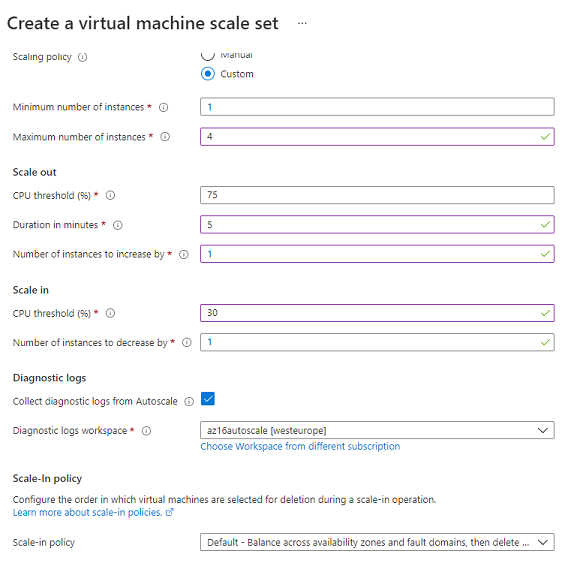
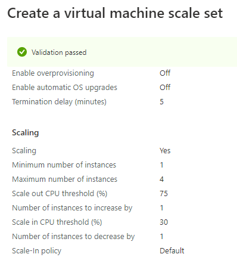
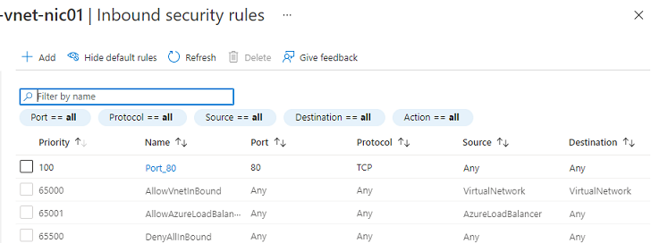
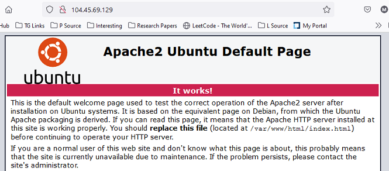
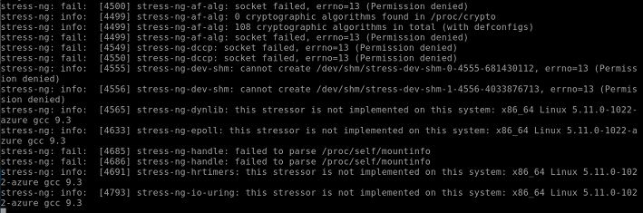
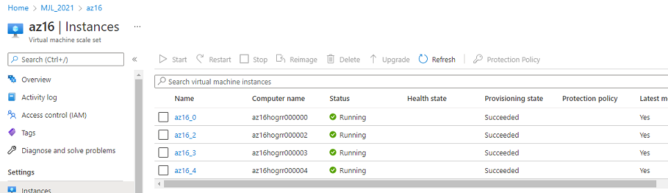
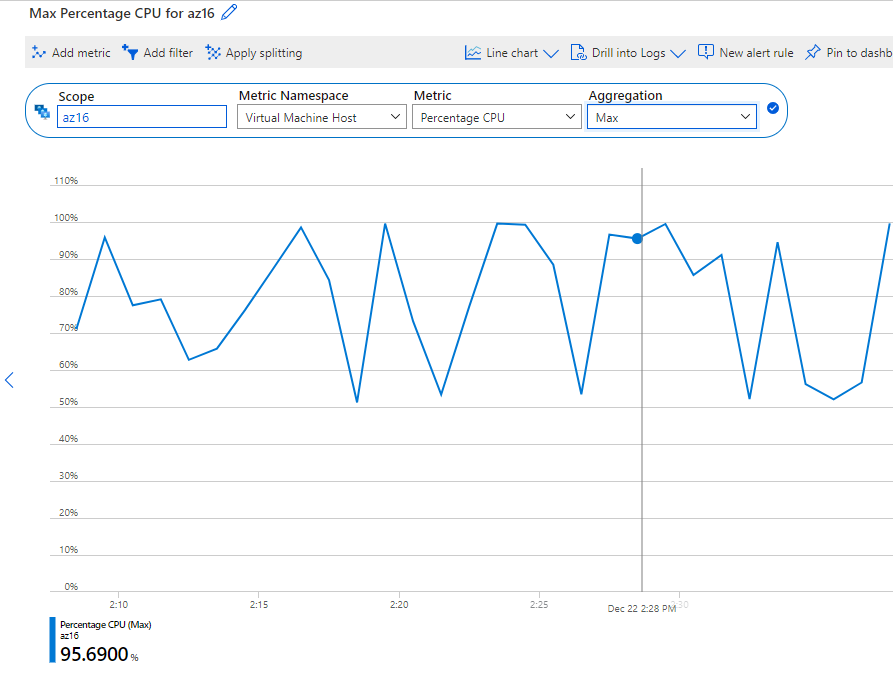
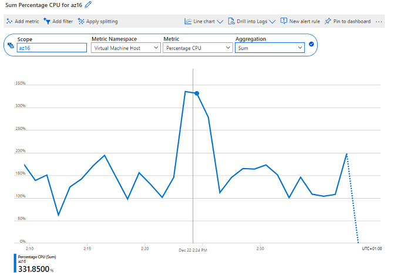

# ALB_Auto Scaling
Met Autoscale kunt u altijd de juiste hoeveelheid resources gebruiken om de eisen van uw load te verwerken. Azure biedt get dients Virtual Machine Scale sets hiervoor. Hiermee kunt u resources toevoegen om de toename van de eisen te verwerken en geld te besparen door middelen die niet actief zijn te verwijderen. U geeft een minimum en maximum aantal VMs op dat moet worden toegevoegd of verwijderd op basis van een set regels:
	-	Scale out: CPU threshold (%), Duration in minutes (analyze metrics), hoeveel worden toegevoegd (elke keer)
	-	Scale in: CPU threshold (%), hoeveel worden verwijderd

Als u een minimum hebt, zorgt u ervoor dat uw toepassing altijd actief is, zelfs als deze niet wordt geladen. Het hebben van een maximum beperkt uw totaal mogelijke uurkosten. Het gebruiken van een VM Scale set is zeker handig als je een workload meemaakt dat ineens kan hoog toenemen en andere keren lang laag blijft (spiky).

Een load balancer kan worden gebruikt voor het gelijkmatig verdelen van de load over een groep bronnen of vms.
Azure Load Balancer werkt op laag 4 van het Open Systems Interconnection (OSI)-model. Het is het enige endpoint voor klanten. Load Balancer verdeelt inkomende stromen die aankomen bij de front-end naar backend pool instances (instanties in een scale set of gewoon VMs) . Deze stromen zijn verdeeld volgens geconfigureerde regels van het balancer en monitoreren. 

Azure heeft twee managed oplossingen voor load balancing naar een fleet van servers:
-	Azure Load Balancer: Je krijgt deze gratis bij een VM Scale Set. De ALB werkt op laag 4 van de OSI stack (TCP/UDP). Een ALB kan alleen routeren naar Azure resources.
-	Application Gateway: Deze load balancer werkt op laag 7 van de OSI stack (HTTP/HTTPS). Ook heeft het support voor onder andere SSL termination en Web Application Firewall (WAF) features. Een Application Gateway kan routeren naar elk routable IP address.

## Key-terms
**public load balancer** : kan uitgaande verbindingen bieden voor virtuele machines (VM's) binnen uw virtuele netwerk. Deze verbindingen worden tot stand gebracht door hun privé IP-adressen te vertalen naar publieke IP-adressen. Public Load Balancers worden gebruikt om het internetverkeer naar uw VM's in evenwicht te brengen.  

**private load balancer** : Wordt gebruikt waar private IP's alleen op de frontend nodig zijn. Interne load balancers worden gebruikt om verkeer binnen een virtueel netwerk in evenwicht te brengen. Een frontend van een load balancer is toegankelijk vanuit een netwerk op locatie in een hybride scenario.  

## Opdracht
Opdracht 1
-	Maak een Virtual Machine Scale Set met de volgende vereisten:
-	Ubuntu Server 20.04 LTS - Gen1
-	Size: Standard_B1ls
-	Allowed inbound ports:
-	SSH (22)
-	HTTP (80)
-	OS Disk type: Standard SSD
-	Networking: defaults
-	Boot diagnostics zijn niet nodig
-	Custom data: 
	#!/bin/bash
sudo su
apt update
apt install apache2 -y
ufw allow 'Apache'
systemctl enable apache2
systemctl restart apache2
-	Initial Instance Count: 2
-	Scaling Policy: Custom
-	Aantal VMs: minimaal 1 en maximaal 4
-	Voeg een VM toe bij 75% CPU gebruik
-	Verwijder een VM bij 30% CPU gebruik

Opdracht 2:
-	Controleer of je via het endpoint van je load balancer bij de webserver kan komen.
-	Voer een load test uit op je server(s) om auto scaling the activeren. Er kan een delay zitten in het creëren van nieuwe VMs, afhankelijk van de settings in je VM Scale Set.

### Gebruikte bronnen
https://docs.microsoft.com/en-us/answers/questions/7989/azure-vmss-autoscale.html
https://docs.microsoft.com/en-us/azure/load-testing/how-to-high-scale-load
https://manpages.ubuntu.com/manpages/jammy/man1/stress-ng.1.html

### Ervaren problemen
Moest manieren uitzoeken om stress test uit te voeren binnen het VM zelf, dus zonder het gebruik van Azure Load testing (wij hebben de benodigde role hiervoor niet - Load Test Contributor). 

### Resultaat  

Settings VM scale set:  
  

Creation VM Scale set:  
  

Inbound Security Rules:  
  

Testing Server:  

Stress Test met comman stress-ng:  

Resultaat van stress test op aantal instanties in scale set:  

Grafiek Percentage CPU met Max aggregatie:  

Grafiek Percentage CPU met Sum aggregatie:  

