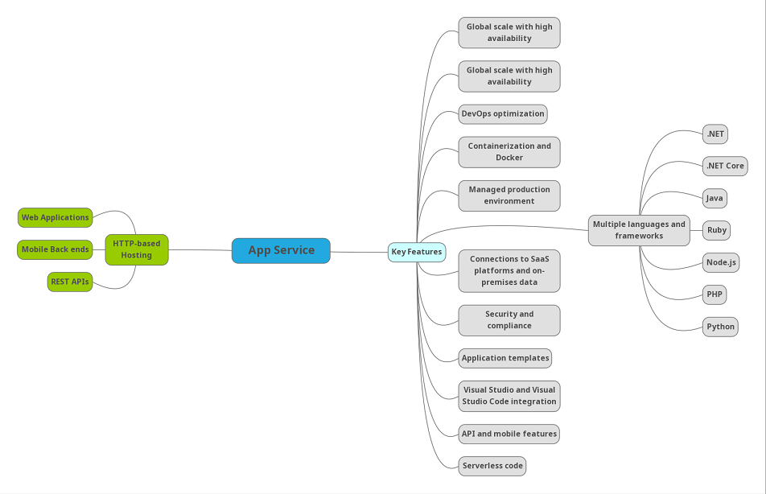
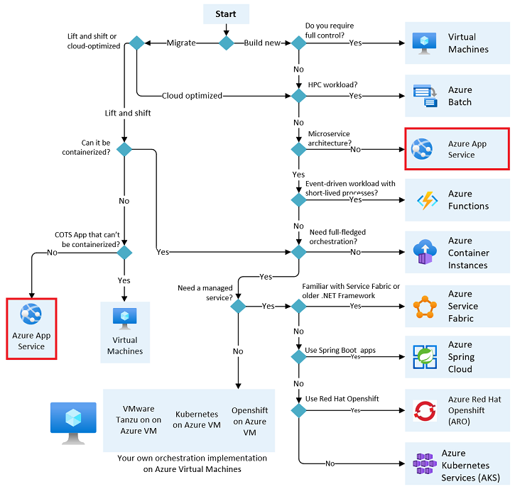

# App Service
Azure App Service is een HTTP-service voor het hosten van webapplicaties, REST-API's en mobiele back-ends.

Door gebruik te maken van de Azure App-service kunt u profiteren van een aantal voordelen die doorgaans met Azure worden geassocieerd, zoals beveiliging, taakverdeling, automatische aanpassing en geautomatiseerd beheer.

Azure App overzicht:  
  

Wanneer gebruike te maken van Azure App Service:  

  

## Key-terms
[App Service plan](../beschrijvingen/App_Service_Plan_+_Environment.md)  
[Azure App Service Environment (ASEs)](../beschrijvingen/App_Service_Plan_+_Environment.md)  

### Gebruikte bronnen
https://docs.microsoft.com/en-us/azure/app-service/overview  
https://docs.microsoft.com/en-us/azure/app-service/overview-hosting-plans  
https://docs.microsoft.com/en-us/azure/architecture/guide/technology-choices/compute-decision-tree  