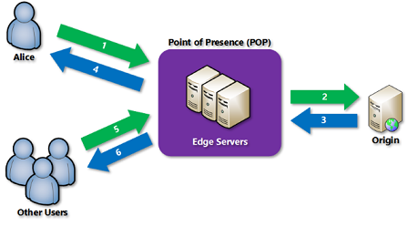

# Azure Content Delivery Network

Azure Content Delivery Network (CDN) is a global CDN solution for delivering high-bandwidth content. It can be hosted in Azure or any other location. With Azure CDN, you can cache static objects loaded from Azure Blob storage, a web application, or any publicly accessible web server, by using the closest point of presence (POP) server. Azure CDN can also accelerate dynamic content, which cannot be cached, by leveraging various network and routing optimizations.

How does it work:  

[See breakdown](https://docs.microsoft.com/en-us/azure/cdn/cdn-overview)

To utilize a CDD there are a number of requirements:

Limitations:

Each Azure subscription has default limits for the following resources:

    The number of CDN profiles that can be created.
    The number of endpoints that can be created in a CDN profile.
    The number of custom domains that can be mapped to an endpoint.

CDN Features:

    Dynamic site acceleration
    CDN caching rules
    HTTPS custom domain support
    Azure diagnostics logs
    File compression
    Geo-filtering

## Key-terms
POP Server

    
### Gebruikte bronnen
https://docs.microsoft.com/en-us/azure/cdn/cdn-overview
https://docs.microsoft.com/en-us/azure/cdn/cdn-features