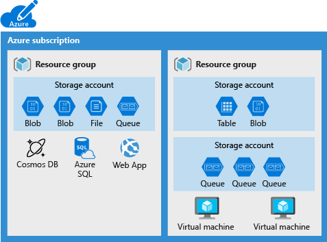
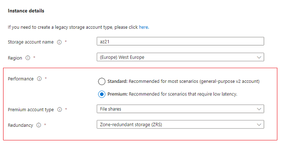
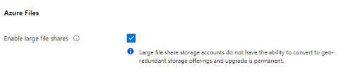
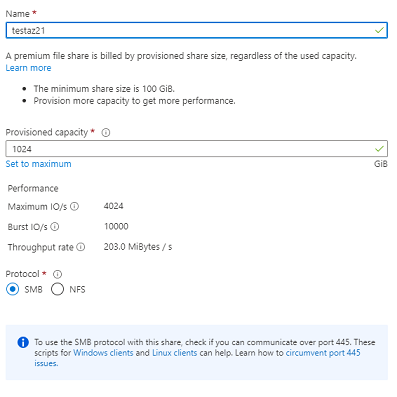
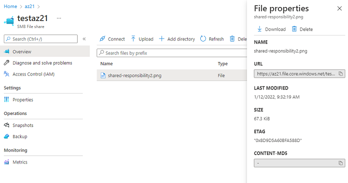

# Azure Files
Azure Files maken deel uit van een groep data services die samen Azure Storage vormen. Alleen dataservices in deze groepering kunnen worden opgenomen in een opslagaccount. Hierdoor kunt u ze op groepsniveau beheren. Andere dataservices zouden als onafhankelijke bronnen moeten worden beheerd.
  
Voorbeeld groepering:  

Azure Files bieden volledig beheerde file shares in de cloud die toegankelijk zijn via het standaardprotocol Server Message Block (SMB) of het NFS-protocol (Network File System). Azure Files file shares kunnen gelijktijdig worden gekoppeld door cloud- of on-premises-implementaties. SMB Azure-bestandsshares zijn toegankelijk vanaf Windows-, Linux- en MacOS-clients. NFS Azure-bestandsshares zijn toegankelijk vanaf Linux- of MacOS-clients. Bovendien kunnen SMB Azure-bestandsshares op Windows-servers worden gecached met Azure File Sync voor snelle toegang waar de gegevens gebruikt worden.

Azure file kan gebruikt worden om:

    -   Lokale file servers vervangen of aanvullen

    -   "Lift and shift" van applicaties

    -   Simplificeren van cloud development:

            -   Shared application settings

            -   Diagnostic share

            -   Dev/Test/Debug

    -   Containerization : Azure file shares kunnen worden gebruikt als persistente volumes voor stateful containers. 

## Key-terms

## Opdrachten

Maken van een Storage account met File sharing:  
  

  

File share met SMB protocol:  
  

File uploaden in de gemaakte File share:  
   

### Gebruikte bronnen
https://docs.microsoft.com/en-us/azure/storage/files/storage-files-introduction  
https://docs.microsoft.com/en-us/azure/storage/files/storage-how-to-create-file-share?tabs=azure-portal  