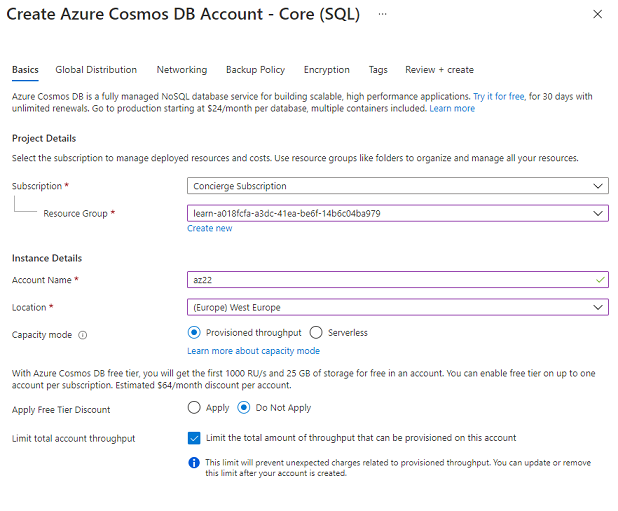
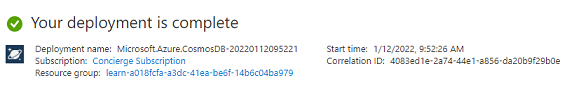
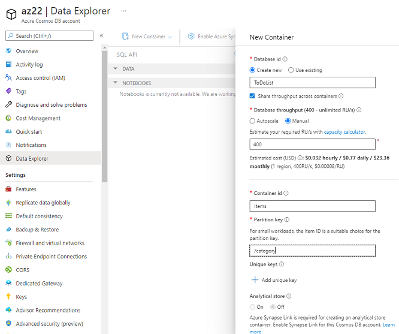
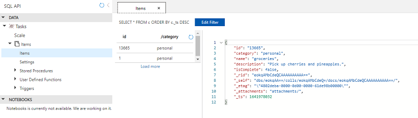

# CosmosDB
Azure Cosmos DB is een volledig beheerde NoSQL database voor moderne app-ontwikkeling die wereldwijd toegankelijk is. 
Azure Cosmos DB biedt meerdere database-API's, waaronder de Core (SQL) API, API voor MongoDB, Cassandra API, Gremlin API en Table API.

Apps die gebruik kunnen maken van CosmoDB:
Web-, mobiele, gaming- en IoT-applicaties die enorme hoeveelheden gegevens, lees- en schrijfbewerkingen op mondiale schaal moeten verwerken met vrijwel reële responstijden, kan profiteren van de gegarandeerde hoge beschikbaarheid, hoge doorvoer, lage latentie en instelbare consistentie van Cosmos DB.

## Opdrachten

Maken van een CosmoDB Account:  
  
  

Database en Container toevoegen:  
  

Data toevoegen en query maken:  
  

## Key-terms

### Gebruikte bronnen
https://docs.microsoft.com/en-us/azure/cosmos-db/
https://docs.microsoft.com/en-us/azure/cosmos-db/sql/create-cosmosdb-resources-portal