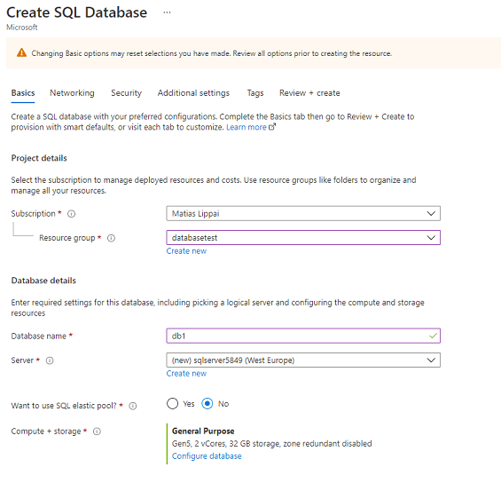
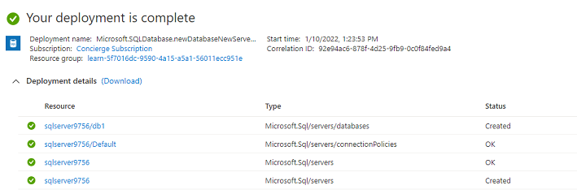
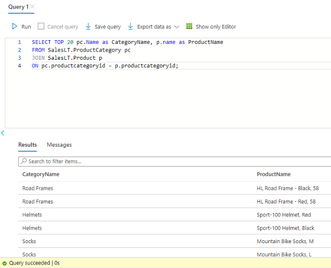
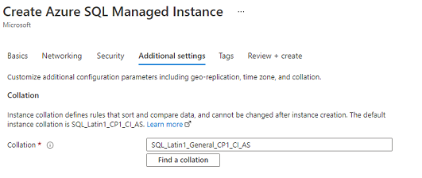

# Azure Database + managed instance
**Azure SQL** is een groep van beheerde, veilige en intelligente producten die gebruikmaken van de SQL Server-database-engine in de Azure-cloud.

Azure SQL Managed Instance is de intelligente, schaalbare clouddatabaseservice die de breedste compatibiliteit van de SQL Server-database-engine combineert met alle voordelen van een volledig beheerd en evergreen platform als service. SQL Managed Instance is bijna 100% compatibel met de nieuwste SQL Server (Enterprise Edition)-database-engine, waardoor een native Virtual Network (Vnet)-implementatie wordt geboden die tegemoetkomt aan algemene beveiligingsproblemen, en een bedrijfsmodel dat gunstig is voor bestaande SQL Server-klanten. Met SQL Managed Instance kunnen bestaande SQL Server-klanten hun lokale applicaties met minimale wijzigingen in applicaties en databases naar de cloud 'lift en shiften'. Tegelijkertijd behoudt SQL Managed Instance alle PaaS-mogelijkheden (automatische patching en versie-updates, geautomatiseerde back-ups, hoge beschikbaarheid) die de beheerkosten en de TCO sterk kunnen verlagen.  
Het implementeren van Managed Instance is een lange operatie die tot 6 uur in beslag neemt.  

Meerdere Azure Database gerelateerde diensten:  

[Azure Cosmos DB](../04_Cloud_3/AZ-22%20CosmosDB.md)  

**Azure Database for MySQL** : Azure Database voor MySQL is een relationele databaseservice in de cloud en is gebaseerd op de MySQL Community Edition-database-engine, versie 5.6, 5.7 en 8.0. Hiermee beschikt u over een 99.99% beschikbaarheidsniveau-overeenkomst van Azure, aangedreven door een wereldwijd netwerk van door Microsoft beheerde datacenters.  

**Azure Database for PostgreSQL** : Azure Database voor PostgreSQL is een relationele databaseservice in de cloud. De serversoftware is gebaseerd op de community-versie van de open-source PostgreSQL database engine. Azure Database voor PostgreSQL is beschikbaar in twee implementatieopties: Single Server en Hyperscale (Citus).  

**Azure Synapse Analytics** : Azure Synapse is een Enterprise Analytics-service de krigen van inzichten in datawarehouses en big data-systemen faciliteert. Azure Synapse combineert het beste van SQL-technologieën die worden gebruikt in Enterprise data warehousing, Spark-technologieën die worden gebruikt voor big data, Data Explorer voor log- en time series-analyses, pipelines voor data-integratie en ETL/ELT, en diepgaande integratie met andere Azure-services zoals Power BI, CosmosDB en AzureML.  

**Azure HDInsight** : is een volledig beheerde, open-source analyseservice voor bedrijven. Je kunt populaire open-source frameworks runnen en clustertypes maken zoals Apache Spark, Apache Hadoop, Apache Kafka, Apache HBase, Apache Storm, En machine Learning Services. HDInsight ondersteunt meerdere scenario's zoals extractie, transformatie en laden (ETL), data warehousing, machine learning, En IoT.  

**Azure Databricks** : een platform voor data-analyse dat geoptimaliseerd is voor het Microsoft Azure. Azure Databricks biedt drie omgevingen voor het ontwikkelen van data-intensieve applicaties: Databricks SQL, Databricks Data Science & Engineering en Databricks machine Learning.  Helpt met inzichten te halen uit al uw data en oplossingen voor AI te bouwen. Azure Databrucs ondersteunt Python, scala, R, Java en SQL, Naast datawetenschappelijke frameworks en bibliotheken zoals TensorFlow, PyTorch en scikit-learn.  

**Azure Data Lake Analytics** : Azure Data Lake Analytics is een dienst voor on-demand analyse die big data vereenvoudigt. In plaats van hardware te implementeren, configureren en af te stemmen, schrijft u query's om uw gegevens te transformeren en waardevolle inzichten te verkrijgen. Data Lake Analytics beheert bronnen op een dynamische manier en zorgt ervoor dat je analyses uit kan voeren op terabytes tot petabytes aan data.

## Opdrachten

SQL Database deploy:  
  

  

SQL Database query:  
  

SQL Managed offers additiona customatization for collation:  

 

## Key-terms

### Gebruikte bronnen
https://docs.microsoft.com/en-us/learn/modules/azure-database-fundamentals/exercise-create-sql-database
https://docs.microsoft.com/en-us/learn/modules/azure-database-fundamentals/