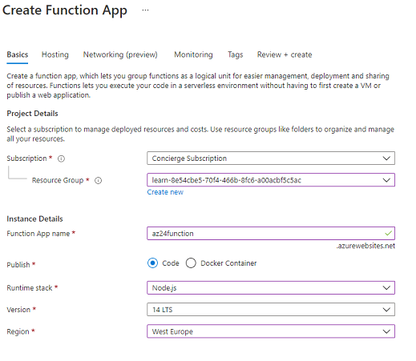
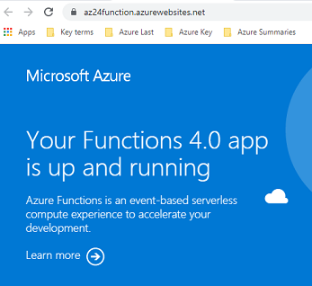
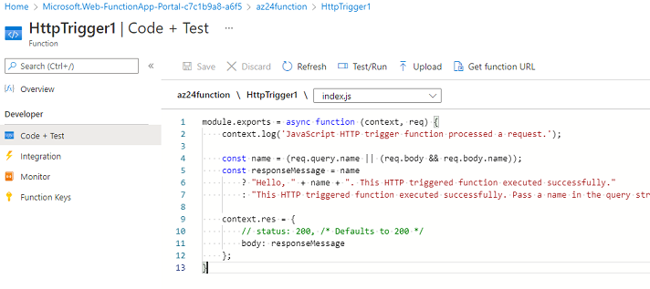
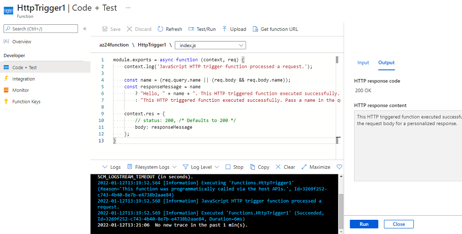

# Azure Functions 

Azure Functions is serverless applicatie platform. Hiermee kunnen ontwikkelaars bedrijfslogica te hosten en uit te voeren zonder voor infrastructuur te zorgen. Deze dienst biedt intrinsieke schaalbaarheid en u wordt alleen belast voor de gebruikte bronnen. U kunt uw functiecode in meerdere talen schrijven, waaronder C#, F#, JavaScript, Python, En PowerShell Core. Ondersteuning voor pakketmanagers als Nuget en NPM is ook inbegrepen, zodat u populaire bibliotheken in uw bedrijfslogica kunt gebruiken.  

Stateless functies zijn ideaale kandidaten voor serverless diensten; functie-instances worden op aanvraag gemaakt en vernietigd. Als 'state' vereist is, kan deze worden opgeslagen in een bijbehorende opslagservice.  

Functies worden door events geactiveerd. Dit betekent dat ze alleen worden uitgevoerd als reactie op een gebeurtenis (een 'trigger' genoemd), zoals het ontvangen van een HTTP-aanvraag of een bericht dat aan een wachtrij wordt toegevoegd. U configureert een trigger als onderdeel van de functiedefinitie. Deze aanpak vereenvoudigt uw code door middel van trigger + input en output instellingen. U kunt zich puur richten op de bedrijfslogica.  

Functies worden gehost in een uitvoeringscontext die een functie-app wordt genoemd. U definieert functie-apps om uw functies logisch te groeperen en te structureren in Azure.  

Functie-apps kunnen een van twee typen serviceplannen gebruiken:

    Consumption plan - Dit plan biedt automatische schaling en factureert u alleen wanneer uw functies actief zijn. Het verbruiksplan wordt geleverd met een configureerbare time-outperiode voor het uitvoeren van een functie. Standaard is dit vijf (5) minuten, maar kan het worden geconfigureerd voor een time-out van 10 minuten.
    Azure App Service plan - Met het Azure App Service-plan kunt u time-outperioden vermijden door uw functie continu te laten draaien op een VM die u definieert. Wanneer u een App Service Plan gebruikt, bent u verantwoordelijk voor het beheer van de app-bronnen waarop de functie wordt uitgevoerd, dus dit is technisch niet een serverless plan.

    
## Opdracht

Funtion App maken:  
  

Funtion App is live:  
  

Loading template:  
  

Testing code:  
  

## Key-terms
**Serverless compute** : kan worden gezien als een functie als service (Faas), of als een microservice die wordt gehost op een cloudplatform. Uw bedrijfslogica werkt als functies en u hoeft de infrastructuur niet handmatig in te richten of te schalen. De cloudprovider beheert de infrastructuur. Afhankelijk van de belasting wordt uw app automatisch geschaald of verlaagd. Azure heeft verschillende manieren om dit soort architectuur te bouwen. De twee meest voorkomende benaderingen zijn Azure Logic Apps en Azure-functies.

### Gebruikte bronnen
https://docs.microsoft.com/en-us/learn/modules/explore-azure-functions/  
https://docs.microsoft.com/en-us/learn/modules/create-serverless-logic-with-azure-functions/1-introduction  