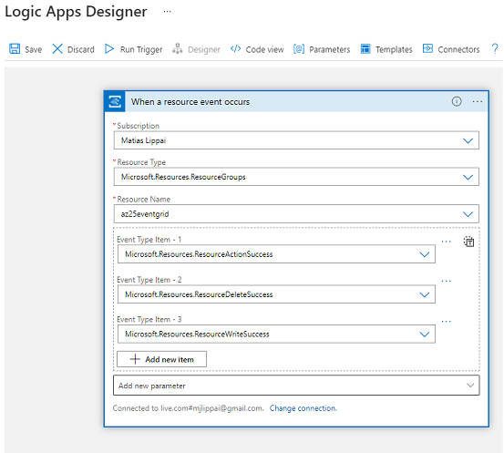
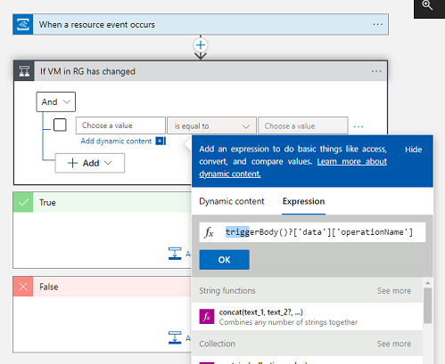
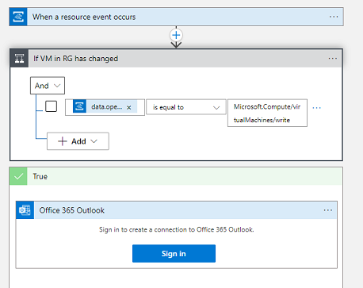

# Event Grid   

Met Azure Event Grid kunt u eenvoudig applicaties met op event gebaseerde architecturen bouwen. Selecteer eerst de Azure-resource waarop u zich wilt abonneren en geef vervolgens de event handler of het WebHook-eindpunt waar u de gebeurtenis naartoe wilt sturen. Event Grid heeft ingebouwde ondersteuning voor gebeurtenissen die afkomstig zijn van Azure-services, zoals storage blobs en resourcegroepen. Event Grid biedt ook ondersteuning voor uw eigen evenementen, met behulp van custom topics.

Logic App opzetten die met Event grid werkt:  
  

Condition toevoegen 'in geval dat VM in RG verandert':  
  

Actie toevogen 'als VM verandert -> stuur een email' :  
  

# Queue Storage

Azure Queue Storage is een service voor het opslaan van grote aantallen berichten. U hebt toegang tot berichten overal ter wereld via geverifieerde oproepen via HTTP of HTTPS. Een wachtrijbericht kan maximaal 64 kB groot zijn. Een wachtrij kan miljoenen berichten bevatten, tot de totale capaciteitslimiet van een opslagaccount.

# Service Bus 

Azure Service Bus is een volledig beheerde enterprise bericht broker met berichtenwachtrijen en publish-subscribe topics. Service Bus wordt gebruikt om applicaties en diensten van elkaar te ontkoppelen, wat de volgende voordelen biedt:

    -   Load-balancing tussen concurrerende workers
    -   Veilige routering en overdracht van data en controle door dienst en applicatie grenzen 
    -   Het coördineren van transactioneel werk dat een hoge mate van betrouwbaarheid vereist

## Key-terms

### Gebruikte bronnen
https://docs.microsoft.com/en-us/azure/service-bus-messaging/service-bus-messaging-overview  
https://docs.microsoft.com/en-us/azure/event-grid/  
https://docs.microsoft.com/en-us/azure/storage/queues/storage-queues-introduction  
