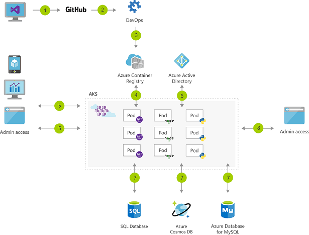

# Containers

A container is an atomic unit of software that packages up code, dependencies, and configuration for a specific application. We call these packages container images, which is then what is used to distribute our applications. Containers allow us to split up monolithic applications into individual services that make up the solution. This rearchitecting of our application will enable us to deploy these separate services via containers. 

Because of their small size (less resource intensive than vms) and application orientation, containers are well suited for agile delivery environments and microservice-based architectures. Orchestration facilitates the use of containers features like deployment management, automatic updates, and self-healing.

**Azure Container Instances** allows you to run a container in Azure, without having to manage any VMs or adopt higher-level services. These can be launched in seconds. Container images can be brought over from Docker Hub, a private Azure container registry, or another cloud-based docker registry. Several common base OS images are cached with ACI, facilitating the deployment of custom application images.
Azure Container Instances enables a layered approach to orchestration, providing all of the scheduling and management capabilities required to run a single container, while allowing orchestrator platforms to manage multi-container tasks on top of it.

Container groups can be accessed directly from the internet with an IP address and a fully qualified domain name (FQDN). DNS name labels can be generated in the format: customlabel.azureregion.azurecontainer.io. 

ACI provides an interactive shell to help with application development and troubleshooting. Access takes places over HTTPS, using TLS to secure client connections.

Of note: Starting January 13, 2020, Azure Container Instances will require all secure connections from servers and applications to use TLS 1.2. Support for TLS 1.0 and 1.1 will be retired.

Some features are currently restricted to Linux containers:

    Multiple containers per container group
    Volume mounting (Azure Files, emptyDir, GitRepo, secret)
    Resource usage metrics with Azure Monitor
    Virtual network deployment
    GPU resources (preview)

**Docker** is open-source technology—and a container file format—for automating the deployment of applications as portable, self-sufficient containers that can run in the cloud or on-premises.

**Azure Kubernetes Service (AKS)** makes it simple to manage a hosted Kubernetes environment in Azure (which can include for example Docker containers). It is best suited for scenarios where you need complete container orchestration, including service discovery across multiple containers, automatic scaling, and coordinated application upgrades. Kubernetes abstracts away complex container management and provides us with declarative configuration to orchestrate containers in different compute environments. 

Example Architecture making use of AKS:  

## Key-terms
**orchestration**: The task of automating and managing a large number of containers and how they interact.  
**fully qualified domain name (FQDN)**: the complete domain name for a specific computer, or host, on the internet. The FQDN consists of two parts: the hostname and the domain name. For example, an FQDN for a hypothetical mail server might be mymail.somecollege.edu   

## Opdracht
### Gebruikte bronnen
https://docs.microsoft.com/en-us/azure/container-instances/container-instances-faq
https://docs.microsoft.com/en-us/azure/container-instances/container-instances-overview  
https://azure.microsoft.com/en-us/topic/kubernetes-vs-docker/  

### Ervaren problemen
Geen
