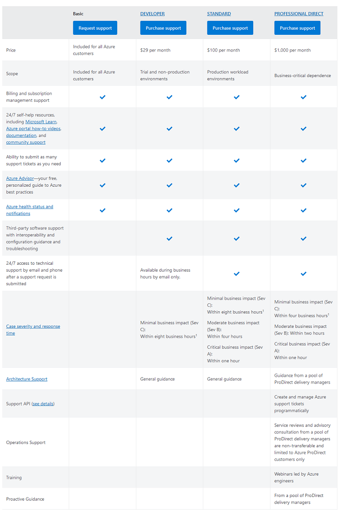

# Azure Support plans

Depending on your particular needs, which can include pricing, response time, scope and others you need to choose the right Azure support plan for you. Luckily Azure has a breakdown to help with this exactly:

  

Azure Prepayment dollars can’t be applied to support plans. Cancellation of support plans won’t result in a prorated refund.

## Key-terms
Pro-Direct: Azure Professional Direct Support tier is the most advanced option and a good fit for mid-size to large companies with substantial business critical utilization of Microsoft Azure.  
  
Critical business impact (Sev A): Customer’s business has significant loss or degradation of services, and requires immediate attention.  
Moderate business impact (Sev B): Customer’s business has moderate loss or degradation of services but work can reasonably continue in an impaired manner.  
Minimal business impact (Sev C): Customer’s business is functioning with minor impediments of services.  

### Gebruikte bronnen
https://azure.microsoft.com/en-us/support/plans/response/  
https://azure.microsoft.com/en-us/support/plans/  
https://azure.microsoft.com/en-us/support/plans/prodirect/  
https://azure.microsoft.com/en-us/support/plans/developer/  

### Ervaren problemen
Geen.
