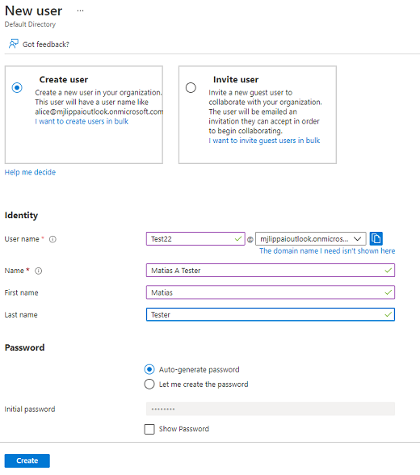
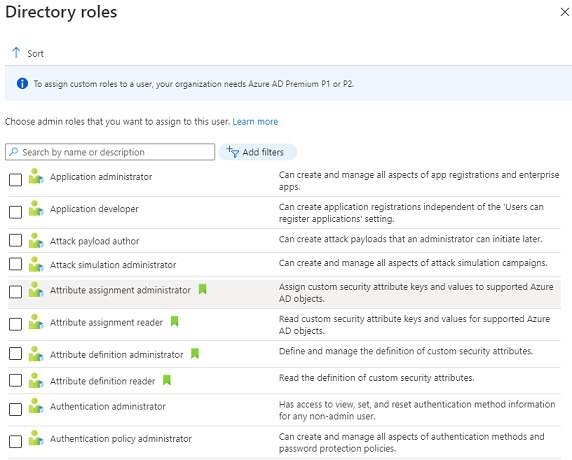

# Azure Active Directory
Azure Active Directory (Azure AD) is Microsoft’s cloud-based identity and access management service.
It allows approved users to access external and internal resources.

Primary uses:
As an IT admin, you can use Azure AD to control access to your apps and your app resources, based on your business requirements. 

As an app developer, you can use Azure AD as a standards-based approach for adding single sign-on (SSO) to your app, allowing it to work with a user's pre-existing credentials. 

Every subscriber to Microsoft 365, Office 365, Azure, or Dynamics CRM Online is automatically an Azure AD tenant, this is how you access these services.

## Key-terms
[Schrijf hier een lijst met belangrijke termen met eventueel een korte uitleg.]

## Opdracht

Creating of a new user with Azure AD:  

Adding roles to user:  

### Gebruikte bronnen
https://docs.microsoft.com/en-us/azure/active-directory/fundamentals/active-directory-whatis

### Ervaren problemen
Geen.
