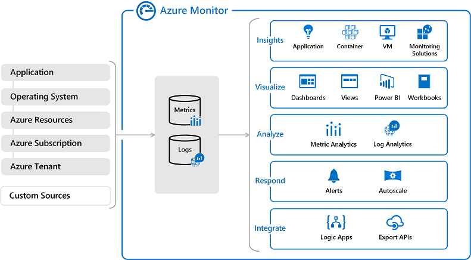

# Azure Monitor
Allows for the collecting, analyzing, and acting on telemetry from your cloud and on-premises environments. 

Just a few examples of what you can do with Azure Monitor include:

    -   Detect and diagnose issues across applications and dependencies with Application Insights.
    -   Correlate infrastructure issues with VM insights and Container insights.
    -   Drill into your monitoring data with Log Analytics for troubleshooting and deep diagnostics.
    -   Support operations at scale with smart alerts and automated actions.
    -   Create visualizations with Azure dashboards and workbooks.
    -   Collect data from monitored resources using Azure Monitor Metrics.

Overview Azure Monitor:

Best use cases for Azure Monitor:  
If you want to keep track of the performance or issues related to your specific VM or container instances, databases, your applications, and so on, you want to visit Azure Monitor and create reports and notifications to help you understand how your services are performing or diagnose issues related to your Azure usage.
Additionally, set up alerts for outages or when autoscaling is about to deploy new instances.

## Key-terms

## Opdracht

To see uses of Azure monitor, you can refer to AZ-16 where this service was used to illustrate the compute usage of multiple VMs launched through VM Scale sets:
[AZ-16](../03_Cloud_2/AZ-16%20ALB_Auto%20Scaling.md)  

### Gebruikte bronnen
https://docs.microsoft.com/en-us/azure/azure-monitor/overview

### Ervaren problemen
Geen.
