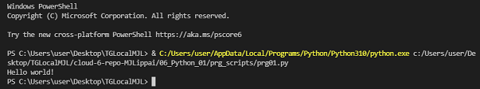

# Setting up
What you first learn in every language. How to print Hello world.
Python syntax is a fairly straightforward language to use and understand.

## Exercise
Install the latest version of Python from https://www.python.org/  
Install VS Code from https://code.visualstudio.com/download  
Install the Python plug-in in VS Code.  
Write the following Python code. The output in the terminal should be the text “Hello world!”  

### Used sources 

Experience gained from edx.org

### Problems
None.

### Result 
[Code](prg_scripts/prg01.py)  

Screenshot code executed:  

