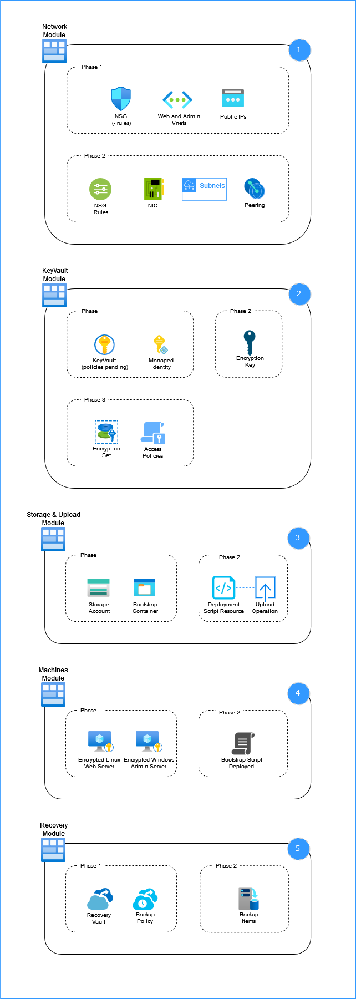
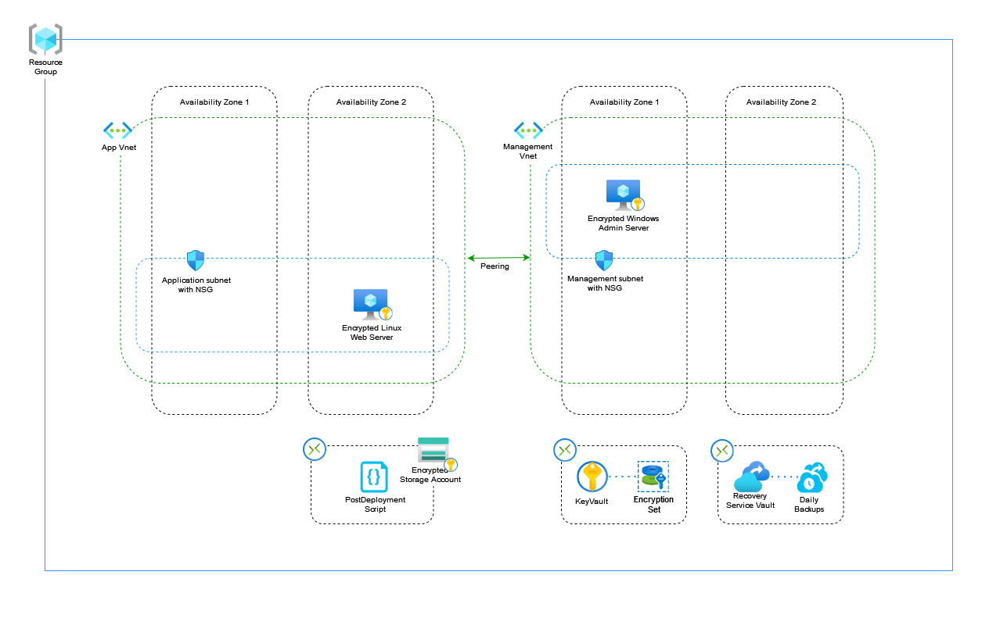

## Goal
Provide practical and technical information for your design. 

---
## Epic
v1.0

---
## Description
This document should include for example the chosen NSG rules, a visualization of what your deployment will consist of and in what order.  
In v1.1 this document will also contain the adjustments and improvements together with the reasoning for their implementation.  

---
## Deliverable

Deployment Order:  

Project V1.0 Diagram:  

NSG Rules:  
    -   Rule admin_trust creates a list of approved IP addresses based on the provided information during deployment. RDP Only.
    -   Rule https_in_webnsg and http_in_webnsg provide access to webserver from internet on Ports 443 and 80.
    -   Rule nsg_webrules provide SSH access ONLY from admin to webserver via private IPs linked from deployed NICs.