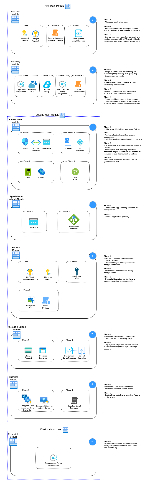

## Goal
Provide practical and technical information for your design. 

---
## Epic
v1.0

---
## Description
This document should include for example the chosen NSG rules, a visualization of what your deployment will consist of and in what order.  

---
## Deliverables

Deployment order and the decision on how to split the project up into modules was based on grouped dependencies and order of deployment.  

Deployment Order:  
  

Overview of modules and their dependencies (VS visualizer):  
  
  

Project V1.1 Diagram:  

NSG Rules:  
    -   Rule admin_trust creates a list of approved IP addresses based on the provided information during deployment. RDP Only.  
    -   Rule https_in_webnsg and http_in_webnsg provide access to webserver from internet on Ports 443 and 80.  
    -   Rule nsg_webrules provide SSH access ONLY from admin to webserver via private IPs linked from deployed NICs.  
    -   Application gateway has special rules required on frontend subnet NSG. 